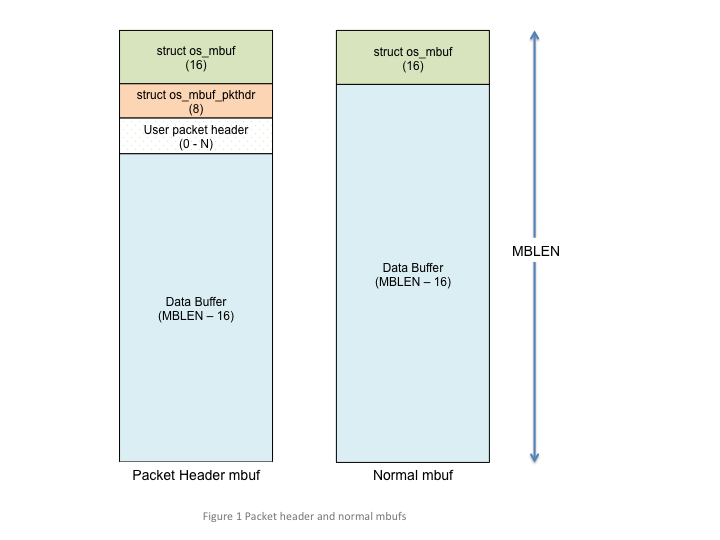
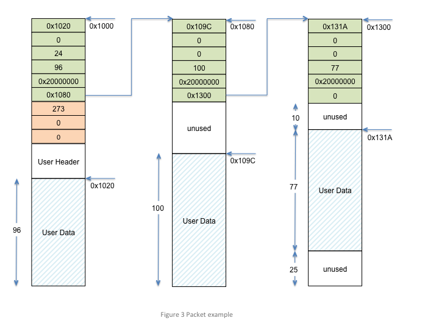

Mbufs
=====

The mbuf (short for memory buffer) is a common concept in networking
stacks. The mbuf is used to hold packet data as it traverses the stack.
The mbuf also generally stores header information or other networking
stack information that is carried around with the packet. The mbuf and
its associated library of functions were developed to make common
networking stack operations (like stripping and adding protocol headers)
efficient and as copy-free as possible.

In its simplest form, an mbuf is a memory block with some space reserved
for internal information and a pointer which is used to "chain" memory
blocks together in order to create a "packet". This is a very important
aspect of the mbuf: the ability to chain mbufs together to create larger
"packets" (chains of mbufs).

Why use mbufs?
----------------

The main reason is to conserve memory. Consider a networking protocol
that generally sends small packets but occasionally sends large ones.
The Bluetooth Low Energy (BLE) protocol is one such example. A flat
buffer would need to be sized so that the maximum packet size could be
contained by the buffer. With the mbuf, a number of mbufs can be chained
together so that the occasional large packet can be handled while
leaving more packet buffers available to the networking stack for
smaller packets.

Packet Header mbuf
--------------------

Not all mbufs are created equal. The first mbuf in a chain of mbufs is a
special mbuf called a "packet header mbuf". The reason that this mbuf is
special is that it contains the length of all the data contained by the
chain of mbufs (the packet length, in other words). The packet header
mbuf may also contain a user defined structure (called a "user header")
so that networking protocol specific information can be conveyed to
various layers of the networking stack. Any mbufs that are part of the
packet (i.e. in the mbuf chain but not the first one) are "normal" (i.e.
non-packet header) mbufs. A normal mbuf does not have any packet header
or user packet header structures in them; they only contain the basic
mbuf header (:c:type:`struct os_mbuf`). Figure 1 illustrates these two types
of mbufs. Note that the numbers/text in parentheses denote the size of
the structures/elements (in bytes) and that MBLEN is the memory block
length of the memory pool used by the mbuf pool.

   Packet header mbuf

Normal mbuf
--------------

Now let's take a deeper dive into the mbuf structure. Figure 2
illustrates a normal mbuf and breaks out the various fields in the
c:type:`os_mbuf` structure.

-  The :c:member:`om_data` field is a pointer to where the data starts inside the
   data buffer. Typically, mbufs that are allocated from the mbuf pool
   (discussed later) have their :c:member:`om_data` pointer set to the start of the
   data buffer but there are cases where this may not be desirable
   (added a protocol header to a packet, for example).
-  The :c:member:`om_flags` field is a set of flags used internally by the mbuf
   library. Currently, no flags have been defined.
-  The :c:member:`om_pkthdr_len` field is the total length of all packet headers
   in the mbuf. For normal mbufs this is set to 0 as there is no packet
   or user packet headers. For packet header mbufs, this would be set to
   the length of the packet header structure (16) plus the size of the
   user packet header (if any). Note that it is this field which
   differentiates packet header mbufs from normal mbufs (i.e. if
   :c:member:`om_pkthdr_len` is zero, this is a normal mbuf; otherwise it is a
   packet header mbuf).
-  The :c:member:`om_len` field contains the amount of user data in the data
   buffer. When initially allocated, this field is 0 as there is no user
   data in the mbuf.
-  The :c:member:`omp_pool` field is a pointer to the pool from which this mbuf
   has been allocated. This is used internally by the mbuf library.
-  The :c:member:`omp_next` field is a linked list element which is used to chain
   mbufs.

Figure 2 also shows a normal mbuf with actual values in the :c:type:`os_mbuf`
structure. This mbuf starts at address 0x1000 and is 256 bytes in total
length. In this example, the user has copied 33 bytes into the data
buffer starting at address 0x1010 (this is where :c:member:`om_data` points). Note
that the packet header length in this mbuf is 0 as it is not a packet
header mbuf.

.. figure:: pics/mbuf_fig2.png
   :alt: OS mbuf structure

   OS mbuf structure

Figure 3 illustrates the packet header mbuf along with some chained
mbufs (i.e a "packet"). In this example, the user header structure is
defined to be 8 bytes. Note that in figure 3 we show a number of
different mbufs with varying :c:member:`om_data` pointers and lengths since we
want to show various examples of valid mbufs. For all the mbufs (both
packet header and normal ones) the total length of the memory block is
128 bytes.

   Packet

Mbuf pools
---------------

Mbufs are collected into "mbuf pools" much like memory blocks. The mbuf
pool itself contains a pointer to a memory pool. The memory blocks in
this memory pool are the actual mbufs; both normal and packet header
mbufs. Thus, the memory block (and corresponding memory pool) must be
sized correctly. In other words, the memory blocks which make up the
memory pool used by the mbuf pool must be at least: sizeof(struct
os\_mbuf) + sizeof(struct os\_mbuf\_pkthdr) + sizeof(struct
user\_defined\_header) + desired minimum data buffer length. For
example, if the developer wants mbufs to contain at least 64 bytes of
user data and they have a user header of 12 bytes, the size of the
memory block would be (at least): 64 + 12 + 16 + 8, or 100 bytes. Yes,
this is a fair amount of overhead. However, the flexibility provided by
the mbuf library usually outweighs overhead concerns.

Create mbuf pool
-----------------

Creating an mbuf pool is fairly simple: create a memory pool and then
create the mbuf pool using that memory pool. Once the developer has
determined the size of the user data needed per mbuf (this is based on
the application/networking stack and is outside the scope of this
discussion) and the size of the user header (if any), the memory blocks
can be sized. In the example shown below, the application requires 64
bytes of user data per mbuf and also allocates a user header (called
struct user\_hdr). Note that we do not show the user header data
structure as there really is no need; all we need to do is to account
for it when creating the memory pool. In the example, we use the macro
*MBUF\_PKTHDR\_OVERHEAD* to denote the amount of packet header overhead
per mbuf and *MBUF\_MEMBLOCK\_OVERHEAD* to denote the total amount of
overhead required per memory block. The macro *MBUF\_BUF\_SIZE* is used
to denote the amount of payload that the application requires (aligned
on a 32-bit boundary in this case). All this leads to the total memory
block size required, denoted by the macro *MBUF\_MEMBLOCK\_OVERHEAD*.

.. code-block:: c

    #define MBUF_PKTHDR_OVERHEAD    sizeof(struct os_mbuf_pkthdr) + sizeof(struct user_hdr)
    #define MBUF_MEMBLOCK_OVERHEAD  sizeof(struct os_mbuf) + MBUF_PKTHDR_OVERHEAD

    #define MBUF_NUM_MBUFS      (32)
    #define MBUF_PAYLOAD_SIZE   (64)
    #define MBUF_BUF_SIZE       OS_ALIGN(MBUF_PAYLOAD_SIZE, 4)
    #define MBUF_MEMBLOCK_SIZE  (MBUF_BUF_SIZE + MBUF_MEMBLOCK_OVERHEAD)
    #define MBUF_MEMPOOL_SIZE   OS_MEMPOOL_SIZE(MBUF_NUM_MBUFS, MBUF_MEMBLOCK_SIZE)

    struct os_mbuf_pool g_mbuf_pool; 
    struct os_mempool g_mbuf_mempool;
    os_membuf_t g_mbuf_buffer[MBUF_MEMPOOL_SIZE];

    void
    create_mbuf_pool(void)
    {
        int rc;
        
        rc = os_mempool_init(&g_mbuf_mempool, MBUF_NUM_MBUFS, 
                              MBUF_MEMBLOCK_SIZE, &g_mbuf_buffer[0], "mbuf_pool");
        assert(rc == 0);

        rc = os_mbuf_pool_init(&g_mbuf_pool, &g_mbuf_mempool, MBUF_MEMBLOCK_SIZE, 
                               MBUF_NUM_MBUFS);
        assert(rc == 0);
    }

Msys
-----

Msys stands for "system mbufs" and is a set of API built on top of the
mbuf code. The basic idea behind msys is the following. The developer
can create different size mbuf pools and register them with msys. The
application then allocates mbufs using the msys API (as opposed to the
mbuf API). The msys code will choose the mbuf pool with the smallest
mbufs that can accommodate the requested size.

Let us walk through an example where the user registers three mbuf pools
with msys: one with 32 byte mbufs, one with 256 and one with 2048. If
the user requests an mbuf with 10 bytes, the 32-byte mbuf pool is used.
If the request is for 33 bytes the 256 byte mbuf pool is used. If an
mbuf data size is requested that is larger than any of the pools (say,
4000 bytes) the largest pool is used. While this behaviour may not be
optimal in all cases that is the currently implemented behaviour. All
this means is that the user is not guaranteed that a single mbuf can
hold the requested data.

The msys code will not allocate an mbuf from a larger pool if the chosen
mbuf pool is empty. Similarly, the msys code will not chain together a
number of smaller mbufs to accommodate the requested size. While this
behaviour may change in future implementations the current code will
simply return NULL. Using the above example, say the user requests 250
bytes. The msys code chooses the appropriate pool (i.e. the 256 byte
mbuf pool) and attempts to allocate an mbuf from that pool. If that pool
is empty, NULL is returned even though the 32 and 2048 byte pools are
not empty.

Note that no added descriptions on how to use the msys API are presented
here (other than in the API descriptions themselves) as the msys API is
used in exactly the same manner as the mbuf API. The only difference is
that mbuf pools are added to msys by calling ``os_msys_register().``

Using mbufs
--------------

The following examples illustrate typical mbuf usage. There are two
basic mbuf allocation API: c:func:`os_mbuf_get()` and
:c:func:`os_mbuf_get_pkthdr()`. The first API obtains a normal mbuf whereas
the latter obtains a packet header mbuf. Typically, application
developers use :c:func:`os_mbuf_get_pkthdr()` and rarely, if ever, need to
call :c:func:`os_mbuf_get()` as the rest of the mbuf API (e.g.
:c:func:`os_mbuf_append()`, :c:func:`os_mbuf_copyinto()`, etc.) typically 
deal with allocating and chaining mbufs. It is recommended to use the 
provided API to copy data into/out of mbuf chains and/or manipulate mbufs.

In ``example1``, the developer creates a packet and then sends the
packet to a networking interface. The code sample also provides an
example of copying data out of an mbuf as well as use of the "pullup"
api (another very common mbuf api).

.. code-block:: c

    void
    mbuf_usage_example1(uint8_t *mydata, int mydata_length)
    {
        int rc;
        struct os_mbuf *om;

        /* get a packet header mbuf */
        om = os_mbuf_get_pkthdr(&g_mbuf_pool, sizeof(struct user_hdr));
        if (om) {
            /* 
             * Copy user data into mbuf. NOTE: if mydata_length is greater than the
             * mbuf payload size (64 bytes using above example), mbufs are allocated
             * and chained together to accommodate the total packet length.
             */
            rc = os_mbuf_copyinto(om, 0, mydata, len);
            if (rc) {
                /* Error! Could not allocate enough mbufs for total packet length */
                return -1;
            }
            
            /* Send packet to networking interface */
            send_pkt(om);
        }
    }

In ``example2`` we show use of the pullup api as this illustrates some
of the typical pitfalls developers encounter when using mbufs. The first
pitfall is one of alignment/padding. Depending on the processor and/or
compiler, the sizeof() a structure may vary. Thus, the size of
*my\_protocol\_header* may be different inside the packet data of the
mbuf than the size of the structure on the stack or as a global
variable, for instance. While some networking protcols may align
protocol information on convenient processor boundaries many others try
to conserve bytes "on the air" (i.e inside the packet data). Typical
methods used to deal with this are "packing" the structure (i.e. force
compiler to not pad) or creating protocol headers that do not require
padding. ``example2`` assumes that one of these methods was used when
defining the *my\_protocol\_header* structure.

Another common pitfall occurs around endianness. A network protocol may
be little endian or big endian; it all depends on the protocol
specification. Processors also have an endianness; this means that the
developer has to be careful that the processor endianness and the
protocol endianness are handled correctly. In ``example2``, some common
networking functions are used: ``ntohs()`` and ``ntohl()``. These are
shorthand for "network order to host order, short" and "network order to
host order, long". Basically, these functions convert data of a certain
size (i.e. 16 bits, 32 bits, etc) to the endianness of the host. Network
byte order is big-endian (most significant byte first), so these
functions convert big-endian byte order to host order (thus, the
implementation of these functions is host dependent). Note that the BLE
networking stack "on the air" format is least signigicant byte first
(i.e. little endian), so a "bletoh" function would have to take little
endian format and convert to host format.

A long story short: the developer must take care when copying structure
data to/from mbufs and flat buffers!

A final note: these examples assume the same mbuf struture and
definitions used in the first example.

.. code-block:: c

    void
    mbuf_usage_example2(struct mbuf *rxpkt)
    {
        int rc;
        uint8_t packet_data[16];
        struct mbuf *om;
        struct my_protocol_header *phdr;

        /* Make sure that "my_protocol_header" bytes are contiguous in mbuf */
        om = os_mbuf_pullup(&g_mbuf_pool, sizeof(struct my_protocol_header));
        if (!om) {
            /* Not able to pull up data into contiguous area */
            return -1;
        }
        
        /* 
         * Get the protocol information from the packet. In this example we presume that we
         * are interested in protocol types that are equal to MY_PROTOCOL_TYPE, are not zero
         * length, and have had some time in flight.
         */
        phdr = OS_MBUF_DATA(om, struct my_protocol_header *);
        type = ntohs(phdr->prot_type);
        length = ntohs(phdr->prot_length);
        time_in_flight = ntohl(phdr->prot_tif);
        
        if ((type == MY_PROTOCOL_TYPE) && (length > 0) && (time_in_flight > 0)) {
            rc = os_mbuf_copydata(rxpkt, sizeof(struct my_protocol_header), 16, packet_data);
            if (!rc) {
                /* Success! Perform operations on packet data */
                <... user code here ...>
            }
        }
        
        /* Free passed in packet (mbuf chain) since we don't need it anymore */
        os_mbuf_free_chain(om);
    }

Mqueue
-------

The mqueue construct allows a task to wake up when it receives data.
Typically, this data is in the form of packets received over a network.
A common networking stack operation is to put a packet on a queue and
post an event to the task monitoring that queue. When the task handles
the event, it processes each packet on the packet queue.

Using Mqueue
--------------

The following code sample demonstrates how to use an mqueue. In this
example:

-  packets are put on a receive queue
-  a task processes each packet on the queue (increments a receive
   counter)

Not shown in the code example is a call ``my_task_rx_data_func``.
Presumably, some other code will call this API.

.. code-block:: c

    uint32_t pkts_rxd;
    struct os_mqueue rxpkt_q;
    struct os_eventq my_task_evq;

    /**
     * Removes each packet from the receive queue and processes it.
     */
    void
    process_rx_data_queue(void)
    {
        struct os_mbuf *om;

        while ((om = os_mqueue_get(&rxpkt_q)) != NULL) {
            ++pkts_rxd;
            os_mbuf_free_chain(om);
        }
    }

    /**
     * Called when a packet is received.
     */
    int
    my_task_rx_data_func(struct os_mbuf *om)
    {
        int rc;

        /* Enqueue the received packet and wake up the listening task. */
        rc = os_mqueue_put(&rxpkt_q, &my_task_evq, om);
        if (rc != 0) {
            return -1;
        }

        return 0;
    }

    void
    my_task_handler(void *arg)
    {
        struct os_event *ev;
        struct os_callout_func *cf;
        int rc;

        /* Initialize eventq */
        os_eventq_init(&my_task_evq);

        /* Initialize mqueue */
        os_mqueue_init(&rxpkt_q, NULL);

        /* Process each event posted to our eventq.  When there are no events to
         * process, sleep until one arrives.
         */
        while (1) {
            os_eventq_run(&my_task_evq);
        }
    }

API
-----------------

.. doxygengroup:: OSMbuf
    :content-only:
    :members:
