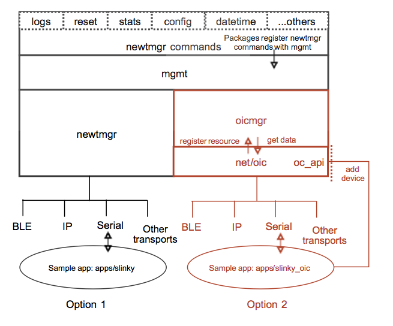

Newt Manager
------------

Newt Manager is the protocol that enables your Mynewt application to
communicate remotely with your device running the Mynewt OS in order to
configure, manage, conduct maintenance, and monitor it. The core device
management module is called ``mgmt`` and offers multiple options for
invoking the appropriate newt manager commands for various operations on
the device e.g. enabling and collecting logs, configuring and retrieving
stats, resetting the device etc.

1. Use the ``newtmgr`` package if reduced code footprint is your primary
   requirement and you do not have interoperability requirements
   upstream for device information, discovery, and connectivity.
2. Use the ``oicmgr`` package if interoperability and standards-based
   connectivity for device interaction is your primary requirement. This
   package supports the OIC (Open Interconnect Consortium) Specification
   1.1.0 framework from Open Connectivity Foundation (OCF).

Invoking Newt Manager commands
~~~~~~~~~~~~~~~~~~~~~~~~~~~~~~

The diagram below indicates the two options available to the application
developer to issue Newt Manager (``newtmgr``) commands on a Mynewt
device. The application may leverage the ``newtmgr`` framework or the
``oicmgr`` framework to call the newtmgr commands. The latter is
described in the next chapter.

   Device Management

newtmgr
~~~~~~~

The newtmgr framework uses a simple request and response message format
to send commands to the device. A message consists of an eight byte
header and the message payload. The message header specifies the newtmgr
command. The message payload contains the newtmgr request/response data
and is encoded in CBOR (Concise Binary Object Representation) format.
newtmgr supports BLE and serial connections.

The newtmgr framework has a smaller code size and memory footprint than
oicmgr but does not support open connectivity.
