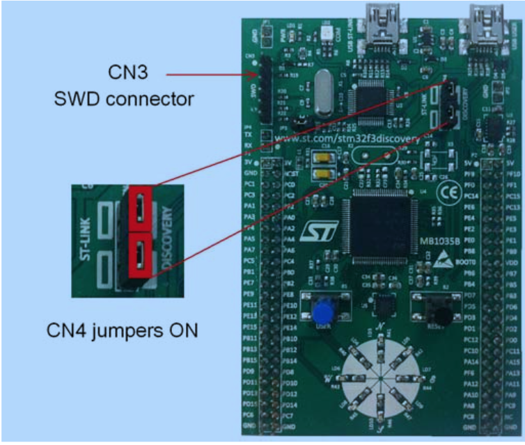

Blinky, your "Hello World!", on STM32F303 Discovery
---------------------------------------------------

Objective
~~~~~~~~~

Learn how to use packages from a default application repository of
Mynewt to build your first *Hello World* application (Blinky) on a
target board. Once built using the *newt* tool, this application will
blink the LED lights on the target board.

Create a project with a simple app that blinks an LED on the stmf303
discovery board. In the process import some external libraries into your
project. Download the application to the target and watch it blink!

What you need
~~~~~~~~~~~~~

-  Discovery kit with STM32F303VC MCU
-  Laptop running Mac OSX.
-  It is assumed you have already installed newt tool.
-  It is assumed you already installed native tools as described
   `here <../get_started/native_tools.html>`__

Also, we assume that you're familiar with UNIX shells. Let's gets
started!

Create a project
~~~~~~~~~~~~~~~~

Create a new project to hold your work. For a deeper understanding, you
can read about project creation in `Get Started -- Creating Your First
Project <../get_started/project_create.html>`__ or just follow the
commands below.

If you've already created a project from another tutorial, you can
re-use that project.

::

    $ mkdir ~/dev
    $ cd ~/dev
    $ newt new myproj
    Downloading project skeleton from apache/incubator-mynewt-blinky...
    Installing skeleton in myproj...
    Project myproj successfully created.

    $ cd myproj

**Note:** Don't forget to change into the ``myproj`` directory.

Import External STM32F3 Library support
~~~~~~~~~~~~~~~~~~~~~~~~~~~~~~~~~~~~~~~

The STM32F303 support for Mynewt lives in an external repository. It's
necessary to add another repository to the project. To do this, edit the
file ``project.yml`` in the root directory of your project ``myproj``

This requires two changes to this file.

1. You must define the properties of the external repository that you
   want to add
2. You must include the repository in your project.

Edit the file ``project.yml`` with your favorite editor and add the
following repository details in the file (after the core repository).
This gives newt the information to contact the repository and extract
its contents. In this case, the repository is on github in the
``runtimeco`` collection. Its name is ``mynewt-stm32f3`` and we will
accept any version up to the latest. You can look at the contents
`here <https://github.com/runtimeco/mynewt_stm32f3>`__.

::

    repository.mynewt_stm32f3:
        type: github
        vers: 0-latest
        user: runtimeco
        repo: mynewt_stm32f3

In the same file, add the following highlighted line to the
``project.repositories`` variable. This tells newt to download the
repository contents into your project.

.. code:: hl_lines="3"

    project.repositories:
        - apache-mynewt-core
        - mynewt_stm32f3

Install dependencies
~~~~~~~~~~~~~~~~~~~~

Now you can install this into the project using:

::

    $ newt install -v 
    Downloading repository description for apache-mynewt-core... success!
    ...
    apache-mynewt-core successfully installed version 0.7.9-none
    ...
    Downloading repository description for mynewt_stm32f3... success!
    Downloading repository mynewt_stm32f3 
    ...
    Resolving deltas: 100% (65/65), done.
    Checking connectivity... done.
    mynewt_stm32f3 successfully installed version 0.0.0-none

Create targets
~~~~~~~~~~~~~~

Create two targets to build using the stmf3 board support package and
the app blinky example from mynewt. The output of these commands are not
shown here for brevity.

The first target is the application image itself. The second target is
the bootloader which allows you to upgrade your mynewt applications.

::

    $ newt target create stmf3_blinky
    $ newt target set stmf3_blinky build_profile=optimized
    $ newt target set stmf3_blinky bsp=@mynewt_stm32f3/hw/bsp/stm32f3discovery
    $ newt target set stmf3_blinky app=apps/blinky

    $ newt target create stmf3_boot
    $ newt target set stmf3_boot app=@apache-mynewt-core/apps/boot
    $ newt target set stmf3_boot bsp=@mynewt_stm32f3/hw/bsp/stm32f3discovery
    $ newt target set stmf3_boot build_profile=optimized

    $ newt target show

    targets/stmf3_blinky
        app=apps/blinky
        bsp=@mynewt_stm32f3/hw/bsp/stm32f3discovery
        build_profile=optimized
    targets/stmf3_boot
        app=apps/boot
        bsp=@mynewt_stm32f3/hw/bsp/stm32f3discovery
        build_profile=optimized

Build the target executables
~~~~~~~~~~~~~~~~~~~~~~~~~~~~

To build the images, use the ``newt build`` command below.

::

    $ newt build stmf3_blinky
       ...
    Archiving stm32f3discovery.a
    Linking blinky.elf
    App successfully built: ~/dev/myproj/bin/stmf3_blinky/apps/blinky/blinky.elf

    $ newt build stmf3_boot
    Compiling log_shell.c
    Archiving log.a
    Linking boot.elf
    App successfully built: ~/dev/myproj/bin/stmf3_boot/apps/boot/boot.elf

Sign and create the blinky application image
~~~~~~~~~~~~~~~~~~~~~~~~~~~~~~~~~~~~~~~~~~~~

You must sign and version your application image to download it using
newt. Use the ``newt create-image`` command to perform this action. Here
we assign this image an arbitrary version ``1.2.3``.

.. code-block:: console

    $ newt create-image stmf3_blinky 1.2.3
    App image successfully generated: ~/dev/myproj/bin/stmf3_blinky/apps/blinky/blinky.img
    Build manifest:~/dev/myproj/bin/stmf3_blinky/apps/blinky/manifest.json

Configure the hardware
~~~~~~~~~~~~~~~~~~~~~~

The STM32F3DISCOVERY board includes an ST-LINK/V2 embedded debug tool
interface that will be used to program/debug the board. To program the
MCU on the board, simply plug in the two jumpers on CN4, as shown in the
picture in red. If you want to learn more about the board you will find
the User Manual at
http://www.st.com/st-web-ui/static/active/jp/resource/technical/document/user_manual/DM00063382.pdf

-  |STMdiscovery|

Download the Images
~~~~~~~~~~~~~~~~~~~

Use the ``newt load`` command to download the images to the target
board.

::

    $ newt -v load stmf3_boot
    $ newt -v load stmf3_blinky

Watch the LED blink
~~~~~~~~~~~~~~~~~~~

Congratulations! You have built, downloaded, and run your first
application using mynewt for the stm32f3 discovery board. One of the
LEDs on the LED wheel should be blinking at 1 Hz.

Want more?
~~~~~~~~~~

Want to make your board do something a little more exciting with the
LEDs? Then try making the modifications to the Blinky app to make it a
`pin-wheel app <pin-wheel-mods.html>`__ and you can light all the LEDs in
a pin-wheel fashion.

We have more fun tutorials for you to get your hands dirty. Be bold and
try other Blinky-like `tutorials <../tutorials/nRF52.html>`__ or try
enabling additional functionality such as `remote
comms <project-slinky.html>`__ on the current board.

If you see anything missing or want to send us feedback, please do so by
signing up for appropriate mailing lists on our `Community
Page <../../community.html>`__.

Keep on hacking and blinking!

