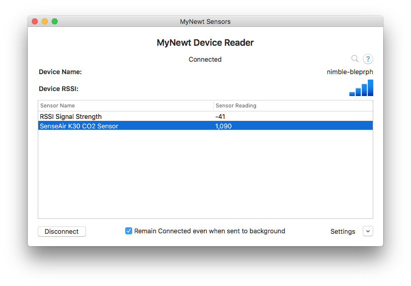

Air quality sensor project via Bluetooth
----------------------------------------

This is a follow-on project to the `Basic Air Quality
Sensor <air_quality_sensor.html>`__ project; so it is assumed that you
have worked through that project and have your CO2 sensor working
properly with your Arduino Primo board.

So let's get started making this thing Bluetooth enabled!

Add Bluetooth GATT Services
~~~~~~~~~~~~~~~~~~~~~~~~~~~

Since we already built the previous demo on the `bluetooth
peripheral <bleprph/bleprph-app.html>`__ basic app most of the bluetooth
plumbing has already been taken care of for us. What's left is for us to
add the required GATT services for advertising the Carbon Dioxide sensor
so that other devices can get those values.

First, we'll define the GATT Services in
``apps/air_quality/src/bleprph.h``.

.. code:: c

    /* Sensor Data */
    /* e761d2af-1c15-4fa7-af80-b5729002b340 */
    static const ble_uuid128_t gatt_svr_svc_co2_uuid =
        BLE_UUID128_INIT(0x40, 0xb3, 0x20, 0x90, 0x72, 0xb5, 0x80, 0xaf,
                         0xa7, 0x4f, 0x15, 0x1c, 0xaf, 0xd2, 0x61, 0xe7);
    #define CO2_SNS_TYPE          0xDEAD
    #define CO2_SNS_STRING "SenseAir K30 CO2 Sensor"
    #define CO2_SNS_VAL           0xBEAD

    uint16_t gatt_co2_val; 

You can use any hex values you choose for the sensor type and sensor
values, and you can even forget the sensor type and sensor string
definitions altogether but they make the results look nice in our
Bluetooth App for Mac OS X and iOS.

Next we'll add those services to ``apps/air_quality/src/gatt_svr.c``.

.. code:: c

    static int
    gatt_svr_sns_access(uint16_t conn_handle, uint16_t attr_handle,
        struct ble_gatt_access_ctxt *ctxt,
        void *arg);
        
    static uint16_t gatt_co2_val_len;

Make sure it is added as *primary* service.

.. code:: c

    static const struct ble_gatt_svc_def gatt_svr_svcs[] = {
        {
            /*** Service: Security test. */
            .type = BLE_GATT_SVC_TYPE_PRIMARY,
            .uuid = &gatt_svr_svc_sec_test_uuid.u,
            .characteristics = (struct ble_gatt_chr_def[]) { {
                /*** Characteristic: Random number generator. */
                .uuid = &gatt_svr_chr_sec_test_rand_uuid.u,
                .access_cb = gatt_svr_chr_access_sec_test,
                .flags = BLE_GATT_CHR_F_READ | BLE_GATT_CHR_F_READ_ENC,
            }, {
                /*** Characteristic: Static value. */
                .uuid = &gatt_svr_chr_sec_test_static_uuid,.u
                .access_cb = gatt_svr_chr_access_sec_test,
                .flags = BLE_GATT_CHR_F_READ |
                         BLE_GATT_CHR_F_WRITE | BLE_GATT_CHR_F_WRITE_ENC,
            }, {
                0, /* No more characteristics in this service. */
            } },
        },
            {
                /*** CO2 Level Notification Service. */
                .type = BLE_GATT_SVC_TYPE_PRIMARY,
                .uuid = &gatt_svr_svc_co2_uuid.u,
                .characteristics = (struct ble_gatt_chr_def[]) { {
                    .uuid = BLE_UUID16_DECLARE(CO2_SNS_TYPE),
                    .access_cb = gatt_svr_sns_access,
                    .flags = BLE_GATT_CHR_F_READ,
                }, {
                    .uuid = BLE_UUID16_DECLARE(CO2_SNS_VAL),
                    .access_cb = gatt_svr_sns_access,
                    .flags = BLE_GATT_CHR_F_NOTIFY,
                }, {
                    0, /* No more characteristics in this service. */
                } },
            },

            {
                0, /* No more services. */
            },
        };
                

Next we need to tell the GATT Server how to handle requests for CO2
readings :

.. code:: c

    sstatic int
    gatt_svr_sns_access(uint16_t conn_handle, uint16_t attr_handle,
                              struct ble_gatt_access_ctxt *ctxt,
                              void *arg)
    {
        uint16_t uuid16;
        int rc;

        uuid16 = ble_uuid_u16(ctxt->chr->uuid);

        switch (uuid16) {
        case CO2_SNS_TYPE:
            assert(ctxt->op == BLE_GATT_ACCESS_OP_READ_CHR);
            rc = os_mbuf_append(ctxt->om, CO2_SNS_STRING, sizeof CO2_SNS_STRING);
            BLEPRPH_LOG(INFO, "CO2 SENSOR TYPE READ: %s\n", CO2_SNS_STRING);
            return rc == 0 ? 0 : BLE_ATT_ERR_INSUFFICIENT_RES;

        case CO2_SNS_VAL:
            if (ctxt->op == BLE_GATT_ACCESS_OP_WRITE_CHR) {
                rc = gatt_svr_chr_write(ctxt->om, 0,
                                        sizeof gatt_co2_val,
                                        &gatt_co2_val,
                                        &gatt_co2_val_len);
                return rc;
            } else if (ctxt->op == BLE_GATT_ACCESS_OP_READ_CHR) {
                rc = os_mbuf_append(ctxt->om, &gatt_co2_val,
                                    sizeof gatt_co2_val);
                return rc == 0 ? 0 : BLE_ATT_ERR_INSUFFICIENT_RES;
            }

        default:
            assert(0);
            return BLE_ATT_ERR_UNLIKELY;
        }
    }

Now it's time to go into our ``apps/air_quality/src/main.c`` and change
how we read CO2 readings and respond to requests.

We'll need a task handler with an event queue for the CO2 readings --
they were handled by the shell task in the previous tutorial but now it
needs to be replaced by a different handler as shown below.

.. code:: c

    /* CO2 Task settings */
    #define CO2_TASK_PRIO           5
    #define CO2_STACK_SIZE          (OS_STACK_ALIGN(336))
    struct os_eventq co2_evq;
    struct os_task co2_task;
    bssnz_t os_stack_t co2_stack[CO2_STACK_SIZE];

And of course we'll need to go to our ``main()`` and do all the standard
task and event setup we normally do by adding the following. Again,
remember to delete all the shell event queues and tasks.

.. code:: c

    /* Initialize sensor eventq */
    os_eventq_init(&co2_evq);

    /* Create the CO2 reader task.  
     * All sensor reading operations are performed in this task.
     */
    os_task_init(&co2_task, "sensor", co2_task_handler,
                NULL, CO2_TASK_PRIO, OS_WAIT_FOREVER,
                co2_stack, CO2_STACK_SIZE);
                

We'll also need to add a task handler -- since we initialized it above:

.. code:: c

    /**
     * Event loop for the sensor task.
     */
    static void
    co2_task_handler(void *unused)
    {    
        while (1) {
            co2_read_event();
            /* Wait 2 second */
            os_time_delay(OS_TICKS_PER_SEC * 2);

        }
    }

And finally, we'll take care of that ``co2_read_event()`` function:

.. code:: c

    int
    co2_read_event(void)
    {
        int value;
        enum senseair_read_type type = SENSEAIR_CO2;
        uint16_t chr_val_handle;
        int rc;

        value = senseair_read(type);
        if (value >= 0) {
            console_printf("Got %d\n", value);
        } else {
            console_printf("Error while reading: %d\n", value);
            goto err;
        }
        gatt_co2_val = value;
        rc = ble_gatts_find_chr(&gatt_svr_svc_co2_uuid.u, BLE_UUID16_DECLARE(CO2_SNS_VAL), NULL, &chr_val_handle);
        assert(rc == 0);
        ble_gatts_chr_updated(chr_val_handle);
        return (0);
    err:
        return (rc);
    }

You'll notice that it looks eeirily similar to a portion of the shell
event we created earlier. This one simply reads and updates the CO2
value and sends that over BLE to any connected clients instead.

We can now build, create-image and load the app onto our Arduino Primo
board, and then connect and see the updated values! The image below
shows the results using MyNewt Sensor Reader, a Mac OS X app developed
for connecting to MyNewt devices over Bluetooth but you can also use
LightBlue or any other application that can connect to, and read,
Bluetooth data.

   MyNewt Sensor Reader

Congratulations!!
