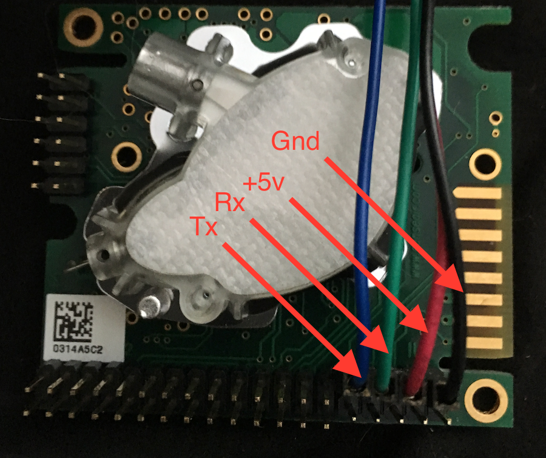
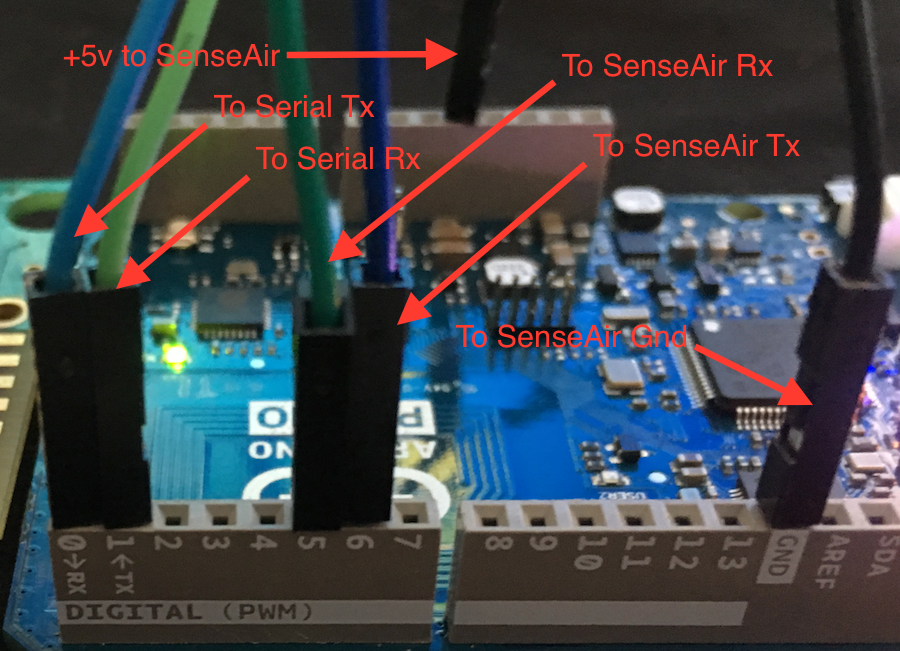

Air quality sensor project
--------------------------

Setting up source tree for stuff you need
~~~~~~~~~~~~~~~~~~~~~~~~~~~~~~~~~~~~~~~~~

To start with, you need to create a new project under which you will do
this development. So you type in:

.. code-block:: console

        $ mkdir $HOME/src
        $ cd $HOME/src
        $ newt new air_quality

Let's say you are using Arduino Primo -- which is based on the Nordic
Semi NRF52 chip -- as the platform. You know you need the board support
package for that hardware. You can look up its location, add it your
project, and fetch that along with the core OS components. Luckily, the
Arduino Primo is supported in the Mynewt Core, so there's nothing much
to do here.

Your project.yml file should look like this:

.. code-block:: console

        [user@IsMyLaptop:~/src/air_quality]$ emacs project.yml &
        [user@IsMyLaptop:~/src/air_quality]$ cat project.yml
        project.name: "air_quality"

        project.repositories:
            - apache-mynewt-core

        # Use github's distribution mechanism for core ASF libraries.
        # This provides mirroring automatically for us.
        #
        repository.apache-mynewt-core:
            type: github
            vers: 0-latest
            user: apache
            repo: mynewt-core

        [user@IsMyLaptop:~/src/air_quality]$ newt install
        apache-mynewt-core
        [user@IsMyLaptop:~/src/air_quality]$ ls repos/
        apache-mynewt-core

Good. You want to make sure you have all the needed bits for supporting
your board; so you decide to build the blinky project for the platform
first.

Now create a target for it and build it. Easiest way to proceed is to
copy the existing target for blinky, and modify it to build for Arduino
Primo board.

.. code-block:: console

    [user@IsMyLaptop:~/src/air_quality]$ newt target copy my_blinky_sim blink_primo
    Target successfully copied; targets/my_blinky_sim --> targets/blink_primo
    [user@IsMyLaptop:~/src/air_quality]$ newt target set blink_primo bsp=@apache-mynewt-core/hw/bsp/arduino_primo_nrf52
    Target targets/blink_nrf successfully set target.bsp to @apache-mynewt-core/hw/bsp/arduino_primo_nrf52
    [user@IsMyLaptop:~/src/air_quality]$ newt build blink_primo
    Compiling hal_bsp.c
    ...
    Linking blinky.elf
    App successfully built: /Users/user/src/air_quality/bin/blink_primo/apps/blinky/blinky.elf

Good.

You know that this platform uses bootloader, which means you have to
create a target for that too.

.. code-block:: console

    [user@IsMyLaptop:~/src/air_quality]$ newt target create boot_primo
    Target targets/boot_nrf successfully created
    [user@IsMyLaptop:~/src/air_quality]$ newt target show
    @apache-mynewt-core/targets/unittest
        bsp=hw/bsp/native
        build_profile=debug
        compiler=compiler/sim
    targets/blink_primo
        app=apps/blinky
        bsp=@apache-mynewt-core/hw/bsp/arduino_primo_nrf52
        build_profile=debug
    targets/boot_primo
    targets/my_blinky_sim
        app=apps/blinky
        bsp=@apache-mynewt-core/hw/bsp/native
        build_profile=debug
    [user@IsMyLaptop:~/src/air_quality]$ newt target set boot_nrf bsp=@apache-mynewt-core/hw/bsp/arduino_primo_nrf52
    Target targets/boot_nrf successfully set target.bsp to @apache-mynewt-core/hw/bsp/arduino_primo_nrf52
    [user@IsMyLaptop:~/src/air_quality]$ newt target set boot_nrf app=@apache-mynewt-core/apps/boot
    Target targets/boot_nrf successfully set target.app to @apache-mynewt-core/apps/boot
    [user@IsMyLaptop:~/src/air_quality]$ newt target set boot_nrf build_profile=optimized
    Target targets/boot_nrf successfully set target.build_profile to optimized

And then build it, and load it onto the board.

.. code-block:: console

    newt build boot_primo
    ....
    Linking boot.elf
    App successfully built: /Users/user/src/air_quality/bin/boot_primo/apps/boot/boot.elf
    [user@IsMyLaptop:~/src/air_quality]
    $ newt load boot_primo

At this point, you may (or may not) see a bunch of error messages about
not being able to connect to your board, not being able to load the
image, etc. If that's the case, and you haven't already, you should most
definitely go worth through the `blinky\_primo <blinky_primo.html>`__
tutorial so that you can properly communicate with your board.

Next you must download the targets to board, and see that the LED
actually blinks. You plug in the Arduino Primo board to your laptop, and
say:

.. code-block:: console

    [user@IsMyLaptop:~/src/air_quality]$ newt load blink_primo
    Loading app image into slot 1
    Error: couldn't open /Users/user/src/air_quality/bin/blink_primo/apps/blinky/blinky.img

    Error: exit status 1

    load - Load app image to target for <target-name>.

    Usage:
      newt load [flags]

    Examples:
      newt load <target-name>

    Global Flags:
      -l, --loglevel string   Log level, defaults to WARN. (default "WARN")
      -o, --outfile string    Filename to tee log output to
      -q, --quiet             Be quiet; only display error output.
      -s, --silent            Be silent; don't output anything.
      -v, --verbose           Enable verbose output when executing commands.
    exit status 1

Ah. Forgot to create an image out of the blinky binary. Note that every
time you want to build and load a new firmware image to a target board,
you need to run 'create-image' on it.

.. code-block:: console

    [user@IsMyLaptop:~/src/air_quality]$ newt create-image blink_primo 0.0.1
    App image successfully generated: /Users/user/src/air_quality/bin/blink_primo/apps/blinky/blinky.img
    Build manifest: /Users/user/src/air_quality/bin/blink_nrf/apps/blinky/manifest.json
    [user@IsMyLaptop:~/src/air_quality]$ newt load blink_primo

And it's blinking.

Shortcut for doing build/create-image/load/debug steps all in one is
'newt run' command. Check out the usage from command line help.

Create test project
~~~~~~~~~~~~~~~~~~~

Now that you have your system setup, you can start creating your own
stuff. First you want to create a project for yourself - you could start
by using blinky as a project template, but since we're going to want to
be able to access the data via Bluetooth, let's use the ``bleprph``
Bluetooth Peripheral project instead.

.. code-block:: console

        [user@IsMyLaptop:~/src/air_quality]$ mkdir apps/air_quality
        [user@IsMyLaptop:~/src/air_quality]$ cp repos/apache-mynewt-core/apps/bleprph/pkg.yml apps/air_quality/
        [user@IsMyLaptop:~/src/air_quality]$ cp -Rp repos/apache-mynewt-core/apps/bleprph/src apps/air_quality/

Then you modify the apps/air\_quality/pkg.yml for air\_quality in order
to change the *pkg.name* to be *apps/air\_quality*. You'll need to add
the ``@apache-mynewt-core/`` path to all the package dependencies, since
the app no longer resides within the apache-mynewt-core repository.

.. code-block:: console

    [user@IsMyLaptop:~/src/air_quality]$ cat apps/air_quality/pkg.yml
    pkg.name: apps/air_quality
    pkg.type: app
    pkg.description: BLE Air Quality application.
    pkg.author: "Apache Mynewt <dev@mynewt.apache.org>"
    pkg.homepage: "http://mynewt.apache.org/"
    pkg.keywords:

    pkg.deps: 
        - "@apache-mynewt-core/kernel/os"
        - "@apache-mynewt-core/sys/shell"
        - "@apache-mynewt-core/sys/stats/full"
        - "@apache-mynewt-core/sys/log/full"
        - "@apache-mynewt-core/mgmt/newtmgr"
        - "@apache-mynewt-core/mgmt/newtmgr/transport/ble"
        - "@apache-mynewt-core/net/nimble/controller"
        - "@apache-mynewt-core/net/nimble/host"
        - "@apache-mynewt-core/net/nimble/host/services/ans"
        - "@apache-mynewt-core/net/nimble/host/services/gap"
        - "@apache-mynewt-core/net/nimble/host/services/gatt"
        - "@apache-mynewt-core/net/nimble/host/store/ram"
        - "@apache-mynewt-core/net/nimble/transport/ram"
        - "@apache-mynewt-core/sys/console/full"
        - "@apache-mynewt-core/sys/sysinit"
        - "@apache-mynewt-core/sys/id"

And create a target for it:

.. code-block:: console

    [user@IsMyLaptop:~/src/air_quality]$ newt target create air_q
    Target targets/air_q successfully created
    [user@IsMyLaptop:~/src/air_quality]$ newt target set air_q bsp=@apache-mynewt-core/hw/bsp/arduino_primo_nrf52
    Target targets/air_q successfully set target.bsp to @apache-mynewt-core/hw/bsp/arduino_primo_nrf52
    [user@IsMyLaptop:~/src/air_quality]$ newt target set air_q app=apps/air_quality 
    Target targets/air_q successfully set target.app to apps/air_quality
    [user@IsMyLaptop:~/src/air_quality]$ newt target set air_q build_profile=debug
    Target targets/air_q successfully set target.build_profile to debug
    [user@IsMyLaptop:~/src/air_quality]$ newt build air_q
     ....
    Linking /Users/dsimmons/dev/myproj/bin/targets/air_q/app/apps/air_quality/air_quality.elf
    Target successfully built: targets/air_q

Create packages for drivers
~~~~~~~~~~~~~~~~~~~~~~~~~~~

One of the sensors you want to enable is SenseAir K30, which will
connect to the board over a serial port. To start development of the
driver, you first need to create a package description for it, and add
stubs for sources.

The first thing to do is to create the directory structure for your
driver:

.. code-block:: console

    [user@IsMyLaptop:~/src/air_quality]$ mkdir -p libs/my_drivers/senseair/include/senseair
    [user@IsMyLaptop:~/src/air_quality]$ mkdir -p libs/my_drivers/senseair/src

Now you can add the files you need. You'll need a pkg.yml to describe
the driver, and then header stub followed by source stub.

.. code-block:: console

    [user@IsMyLaptop:~/src/air_quality]$ cat libs/my_drivers/senseair/pkg.yml

.. code:: c

    #
    # Licensed to the Apache Software Foundation (ASF) under one
    # or more contributor license agreements.  See the NOTICE file
    # distributed with this work for additional information
    # regarding copyright ownership.  The ASF licenses this file
    # to you under the Apache License, Version 2.0 (the
    # "License"); you may not use this file except in compliance
    # with the License.  You may obtain a copy of the License at
    # 
    #  http://www.apache.org/licenses/LICENSE-2.0
    #
    # Unless required by applicable law or agreed to in writing,
    # software distributed under the License is distributed on an
    # "AS IS" BASIS, WITHOUT WARRANTIES OR CONDITIONS OF ANY
    # KIND, either express or implied.  See the License for the
    # specific language governing permissions and limitations
    # under the License.
    #
    pkg.name: libs/my_drivers/senseair
    pkg.description: Host side of the nimble Bluetooth Smart stack.
    pkg.author: "Apache Mynewt <dev@mynewt.apache.org>"
    pkg.homepage: "http://mynewt.apache.org/"
    pkg.keywords:
        - ble
        - bluetooth

    pkg.deps:
        - "@apache-mynewt-core/kernel/os"

.. code-block:: console

    [user@IsMyLaptop:~/src/air_quality]$ cat libs/my_drivers/senseair/include/senseair/senseair.h

.. code:: c

    /*
     * Licensed to the Apache Software Foundation (ASF) under one
     * or more contributor license agreements.  See the NOTICE file
     * distributed with this work for additional information
     * regarding copyright ownership.  The ASF licenses this file
     * to you under the Apache License, Version 2.0 (the
     * "License"); you may not use this file except in compliance
     * with the License.  You may obtain a copy of the License at
     * 
     *  http://www.apache.org/licenses/LICENSE-2.0
     *
     * Unless required by applicable law or agreed to in writing,
     * software distributed under the License is distributed on an
     * "AS IS" BASIS, WITHOUT WARRANTIES OR CONDITIONS OF ANY
     * KIND, either express or implied.  See the License for the
     * specific language governing permissions and limitations
     * under the License.
    */
    #ifndef _SENSEAIR_H_
    #define _SENSEAIR_H_
        
    void senseair_init(void);
        
    #endif /* _SENSEAIR_H_ */

.. code-block:: console

    [user@IsMyLaptop:~/src/air_quality]$ cat libs/my_drivers/senseair/src/senseair.c

.. code:: c

    /**
     * Licensed to the Apache Software Foundation (ASF) under one
     * or more contributor license agreements.  See the NOTICE file
     * distributed with this work for additional information
     * regarding copyright ownership.  The ASF licenses this file
     * to you under the Apache License, Version 2.0 (the
     * "License"); you may not use this file except in compliance
     * with the License.  You may obtain a copy of the License at
     * 
     *  http://www.apache.org/licenses/LICENSE-2.0
     *
     * Unless required by applicable law or agreed to in writing,
     * software distributed under the License is distributed on an
     * "AS IS" BASIS, WITHOUT WARRANTIES OR CONDITIONS OF ANY
     * KIND, either express or implied.  See the License for the
     * specific language governing permissions and limitations
     * under the License.
     */
        
    void
    senseair_init(void)
    {
    }

And add dependency to this package in your project yml file.

Here's the listing from apps/air\_quality/pkg.yml

.. code-block:: console

    pkg.name: apps/air_quality
    pkg.type: app
    pkg.description: Air quality sensor test
    pkg.keywords:

    pkg.deps:
        - "@apache-mynewt-core/libs/console/full"
        - "@apache-mynewt-core/libs/newtmgr"
        - "@apache-mynewt-core/libs/os"
        - "@apache-mynewt-core/libs/shell"
        - "@apache-mynewt-core/sys/config"
        - "@apache-mynewt-core/sys/log/full"
        - "@apache-mynewt-core/sys/stats/full"
        - libs/my_drivers/senseair

And add a call to your main() to initialize this driver.

.. code-block:: console

        [user@IsMyLaptop:~/src/air_quality]$ diff project/blinky/src/main.c project/air_quality/src/main.c
        28a29
        > #include <senseair/senseair.h>
        190a192
        > senseair_init();
        [user@IsMyLaptop:~/src/air_quality

The ble\_prph app runs everything in one task handler. For this project,
we're going to add a second task handler to respond to the shell, and
then handle communicating with the senseair sensor for us.

.. code:: c

    /** shell task settings. */
    #define SHELL_TASK_PRIO           2
    #define SHELL_STACK_SIZE          (OS_STACK_ALIGN(336))

    struct os_eventq shell_evq;
    struct os_task shell_task;
    bssnz_t os_stack_t shell_stack[SHELL_STACK_SIZE];

That defines the task, now we need to initialize it, add a task handler,
and we're going to use this task as our default task handler.

.. code:: c

    /**
     * Event loop for the main shell task.
     */
    static void
    shell_task_handler(void *unused)
    {
        while (1) {
            os_eventq_run(&shell_evq);
        }
    }

And in your ``main()`` add:

.. code:: c

        /* Initialize shell eventq */
        os_eventq_init(&shell_evq);

        /* Create the shell task.  
         * All shell operations are performed in this task.
         */
        os_task_init(&shell_task, "shell", shell_task_handler,
                                  NULL, SHELL_TASK_PRIO, OS_WAIT_FOREVER,
                                  shell_stack, SHELL_STACK_SIZE);

Don't forget to change your default task handler!

.. code:: c

        os_eventq_dflt_set(&shell_evq);

And then build it to make sure all goes well.

.. code-block:: console

    [user@IsMyLaptop:~/src/air_quality]$ newt build air_q
    Compiling senseair.c
    Archiving senseair.a
    Linking air_quality.elf
    App successfully built: /Users/user/src/air_quality/bin/air_q/apps/air_quality/air_quality.elf

All looks good.

Add CLI commands for testing drivers
~~~~~~~~~~~~~~~~~~~~~~~~~~~~~~~~~~~~

While developing the driver, you want to issue operations from console
asking it to do stuff. We'll assume that you've already worked through
the tutorial on how to `enable the CLI <blinky_console.html>`__, so all
we'll need to do is add the propper values to the project's
``syscfg.yml`` file:

.. code-block:: console

    [user@IsMyLaptop:~/src/air_quality]$ cat targets/air_q/syscfg.yml
    syscfg.vals:
        # Set as per blinky_primo
        OPENOCD_DEBUG: 1
        # Enable the shell task.
        SHELL_TASK: 1
        STATS_CLI: 1
        CONSOLE_TICKS: 1
        CONSOLE_PROMPT: 1

Then register your senseair command with the shell by adding the
following to ``libs/my_drivers/senseair/src/senseair.c``

.. code:: c

    #include <shell/shell.h>
    #include <console/console.h>
    #include <assert.h>

    static int senseair_shell_func(int argc, char **argv);
    static struct shell_cmd senseair_cmd = {
        .sc_cmd = "senseair",
        .sc_cmd_func = senseair_shell_func,
    };

    void
    senseair_init(void)
    {
        int rc;

        rc = shell_cmd_register(&senseair_cmd);
        assert(rc == 0);
    }

    static int
    senseair_shell_func(int argc, char **argv)
    {
        console_printf("Yay! Somebody called!\n");
        return 0;

    }

Now you can you build this, download to target, and start minicom on
your console port. If you haven't already, familiarize yourself with the
tutorial on how to connect a serial port to your board
`here <../get_started/serial_access.html>`__.

You'll need to wire up your Board to a Serial converter first. On the
Arduino Primo Board pin 1 is TX and pin 0 is RX so wire 1 to RX on your
serial board, and 0 to TX on your serial board.

.. code-block:: console

        [user@IsMyLaptop:~]$ minicom -D /dev/tty.usbserial-AH02MIE2
        
        
        Welcome to minicom 2.7
        
        OPTIONS: 
        Compiled on Oct 12 2015, 07:48:30.
        Port /dev/tty.usbserial-AH02MIE2, 13:44:40
        
        Press CTRL-X Z for help on special keys
        
        ?
        419: > ?
        Commands:
        641:     stat      echo         ?    prompt     ticks     tasks
        643: mempools      date  senseair
        644: > senseair
        Yay! Somebody called!
        1125: >
        53611: > tasks
        Tasks:
        54047:    task pri tid  runtime      csw    stksz   stkuse   lcheck   ncheck flg
        54057:    idle 255   0    54048    66890       64       30        0        0   0
        54068:  ble_ll   0   1        9    64986       80       58        0        0   0
        54079: bleprph   1   2        0        1      336       32        0        0   0
        54090:   shell   2   3        0     2077      336      262        0        0   0
        54101: >

That's great. Your shell task is running, and is responding
appropriately! You can connect the hardware to your board and start
developing code for the driver itself.

Use of HAL for drivers
~~~~~~~~~~~~~~~~~~~~~~

The sensor has a serial port connection, and that's how you are going to
connect to it. Your original BSP, hw/bsp/arduino\_primo\_nrf52, has two
UARTs set up. We're using one for our shell/console. It also has a
second UART set up as a 'bit-bang' UART but since the SenseAir only
needs to communicate at 9600 baud, this bit-banged uart is plenty fast
enough.

You'll have to make a small change to the ``syscfg.yml`` file in your
project's target directory to change the pin definitions for this second
UART. Those changes are as follows:

.. code-block:: console

        UART_0_PIN_TX: 23
        UART_0_PIN_RX: 24

With this in place, you can refer to serial port where your SenseAir
sensor by a logical number. This makes the code more platform
independent - you could connect this sensor to another board, like
Olimex. You will also use the HAL UART abstraction to do the UART port
setup and data transfer. That way you don't need to have any platform
dependent pieces within your little driver.

You will now see what the driver code ends up looking like. Here's the
header file, filled in from the stub you created earlier.

.. code:: c

    /*
     * Licensed to the Apache Software Foundation (ASF) under one
     * or more contributor license agreements.  See the NOTICE file
     * distributed with this work for additional information
     * regarding copyright ownership.  The ASF licenses this file
     * to you under the Apache License, Version 2.0 (the
     * "License"); you may not use this file except in compliance
     * with the License.  You may obtain a copy of the License at
     * 
     *  http://www.apache.org/licenses/LICENSE-2.0
     *
     * Unless required by applicable law or agreed to in writing,
     * software distributed under the License is distributed on an
     * "AS IS" BASIS, WITHOUT WARRANTIES OR CONDITIONS OF ANY
     * KIND, either express or implied.  See the License for the
     * specific language governing permissions and limitations
     * under the License.
    */
    #ifndef _SENSEAIR_H_
    #define _SENSEAIR_H_

    enum senseair_read_type {
            SENSEAIR_CO2,
    };

    int senseair_init(int uartno);

    int senseair_read(enum senseair_read_type);

    #endif /* _SENSEAIR_H_ */

As you can see, logical UART number has been added to the init routine.
A 'read' function has been added, which is a blocking read. If you were
making a commercial product, you would probably have a callback for
reporting the results.

And here is the source for the driver.

.. code:: c

    /**
     * Licensed to the Apache Software Foundation (ASF) under one
     * or more contributor license agreements.  See the NOTICE file
     * distributed with this work for additional information
     * regarding copyright ownership.  The ASF licenses this file
     * to you under the Apache License, Version 2.0 (the
     * "License"); you may not use this file except in compliance
     * with the License.  You may obtain a copy of the License at
     *
     *  http://www.apache.org/licenses/LICENSE-2.0
     *
     * Unless required by applicable law or agreed to in writing,
     * software distributed under the License is distributed on an
     * "AS IS" BASIS, WITHOUT WARRANTIES OR CONDITIONS OF ANY
     * KIND, either express or implied.  See the License for the
     * specific language governing permissions and limitations
     * under the License.
     */
    #include <string.h>
        
    #include <shell/shell.h>
    #include <console/console.h>
    #include <os/os.h>
        
    #include <hal/hal_uart.h>
        
    #include "senseair/senseair.h"
        
    static const uint8_t cmd_read_co2[] = {
        0xFE, 0X44, 0X00, 0X08, 0X02, 0X9F, 0X25
    };
        
    static int senseair_shell_func(int argc, char **argv);
    static struct shell_cmd senseair_cmd = {
        .sc_cmd = "senseair",
        .sc_cmd_func = senseair_shell_func,
    };
        
    struct senseair { 
        int uart;
        struct os_sem sema;
        const uint8_t *tx_data;
        int tx_off;
        int tx_len;
        uint8_t rx_data[32]; 
        int rx_off;
        int value;
    } senseair;
        
    static int
    senseair_tx_char(void *arg)
    {
        struct senseair *s = &senseair;
        int rc;

        if (s->tx_off >= s->tx_len) {
        /*
             * Command tx finished.
             */
            s->tx_data = NULL;
            return -1;
        }

        rc = s->tx_data[s->tx_off];
        s->tx_off++;
        return rc;
    }
        
    /*
     * CRC for modbus over serial port.
     */
    static const uint16_t mb_crc_tbl[] = {
        0x0000, 0xcc01, 0xd801, 0x1400, 0xf001, 0x3c00, 0x2800, 0xe401,
        0xa001, 0x6c00, 0x7800, 0xb401, 0x5000, 0x9c01, 0x8801, 0x4400
    };
        
    static uint16_t
    mb_crc(const uint8_t *data, int len, uint16_t crc)
    {
        while (len-- > 0) {
            crc ^= *data++;
            crc = (crc >> 4) ^ mb_crc_tbl[crc & 0xf];
            crc = (crc >> 4) ^ mb_crc_tbl[crc & 0xf];
        }
        return crc;
    }
        
    static int
    mb_crc_check(const void *pkt, int len)
    {
        uint16_t crc, cmp;
        uint8_t *bp = (uint8_t *)pkt;

        if (len < sizeof(crc) + 1) {
            return -1;
        }
        crc = mb_crc(pkt, len - 2, 0xffff);
        cmp = bp[len - 2] | (bp[len - 1] << 8);
        if (crc != cmp) {
            return -1;
        } else {
            return 0;
        }
    }
        
    static int
    senseair_rx_char(void *arg, uint8_t data)
    {
        struct senseair *s = (struct senseair *)arg;
        int rc;

        if (s->rx_off >= sizeof(s->rx_data)) {
            s->rx_off = 0;
        }
        s->rx_data[s->rx_off] = data;
        s->rx_off++;

        if (s->rx_off == 7) {
            rc = mb_crc_check(s->rx_data, s->rx_off);
            if (rc == 0) {
                s->value = s->rx_data[3] * 256 + s->rx_data[4];
                os_sem_release(&s->sema);
            }
        }
        return 0;
    }
        
    void
    senseair_tx(struct senseair *s, const uint8_t *tx_data, int data_len)
    {
        s->tx_data = tx_data;
        s->tx_len = data_len;
        s->tx_off = 0;
        s->rx_off = 0;

        hal_uart_start_tx(s->uart);
    }
        
    int
    senseair_read(enum senseair_read_type type)
    {
        struct senseair *s = &senseair;
        const uint8_t *cmd;
        int cmd_len;
        int rc;
        
        if (s->tx_data) {
            /*
             * busy
             */
            return -1;
        }
        switch (type) {
        case SENSEAIR_CO2:
            cmd = cmd_read_co2;
            cmd_len = sizeof(cmd_read_co2);
            break;
        default:
            return -1;
        }
        senseair_tx(s, cmd, cmd_len);
        rc = os_sem_pend(&s->sema, OS_TICKS_PER_SEC / 2);
        if (rc == OS_TIMEOUT) {
            /*
             * timeout
             */
            return -2;
        }
        return s->value;
    }
        
    static int
    senseair_shell_func(int argc, char **argv)
    {
        int value;
        enum senseair_read_type type;
        
        if (argc < 2) {
    usage:
            console_printf("%s co2\n", argv[0]);
            return 0;
        }
        if (!strcmp(argv[1], "co2")) {
            type = SENSEAIR_CO2;
        } else {
            goto usage;
        }
        value = senseair_read(type);
        if (value >= 0) {
            console_printf("Got %d\n", value);
        } else {
            console_printf("Error while reading: %d\n", value);
        }
        return 0;
    }
        
    int
    senseair_init(int uartno)
    {
        int rc;
        struct senseair *s = &senseair;
        
        rc = shell_cmd_register(&senseair_cmd);
        if (rc) {
            return rc;
        }
        
        rc = os_sem_init(&s->sema, 1);
        if (rc) {
            return rc;
        }
        rc = hal_uart_init_cbs(uartno, senseair_tx_char, NULL,
          senseair_rx_char, &senseair);
        if (rc) {
            return rc;
        }
        rc = hal_uart_config(uartno, 9600, 8, 1, HAL_UART_PARITY_NONE,
          HAL_UART_FLOW_CTL_NONE);
        if (rc) {
            return rc;
        }
        s->uart = uartno;
        
        return 0;
    }

And your modified main() for senseair driver init.

.. code:: c

    int
    main(int argc, char **argv)
    {
        ....
        senseair_init(0);
        ....
        }

You can see from the code that you are using the HAL interface to open a
UART port, and using OS semaphore as a way of blocking the task when
waiting for read response to come back from the sensor.

Now comes the fun part: Hooking up the sensor! It's fun because a)
hooking up a sensor is always fun and b) the SenseAir sensor's PCB is
entirely unlabeled, so you'll have to trust us on how to hook it up.

So here we go.

You'll have to do a little soldering. I soldered some header pins to the
SenseAir K30 board to make connecting wires easier using standard jumper
wires, but you can also just solder wires straight to the board if you
prefer.

Here's what your SenseAir board should look like once it's wired up:

   SenseAir Wiring

Now that you have that wired up, let's get the Arduino Primo wired up. A
couple of things to note:

-  The Arduino Primo's 'console' UART is actually UART1.
-  The secondary (bit-banged) UART is UART0, so that's where we'll have
   to hook up the SenseAir.

Here's what your Arduino Primo should now look like with everything
wired in:

   SenseAir and Arduino Primo Wiring

Everything is wired and you're ready to go! Build and load your new app:

.. code-block:: console

    $ newt build air_q
    Building target targets/air_q
    Compiling apps/air_quality/src/main.c
    Archiving apps_air_quality.a
    Linking myproj/bin/targets/air_q/app/apps/air_quality/air_quality.elf
    Target successfully built: targets/air_q
    $ newt create-image air_q 1.0.0
    App image succesfully generated: myproj/bin/targets/air_q/app/apps/air_quality/air_quality.img
    $ newt load air_q
    Loading app image into slot 1

Now, you should be able to connect to your serial port and read values:

::

    user@IsMyLaptop:~]$ minicom -D /dev/tty.usbserial-AH02MIE2
        
        
        Welcome to minicom 2.7
        
        OPTIONS: 
        Compiled on Oct 12 2015, 07:48:30.
        Port /dev/tty.usbserial-AH02MIE2, 13:44:40
        
        Press CTRL-X Z for help on special keys
        
        1185: > ?
        Commands:
        1382:     stat      echo         ?    prompt     ticks     tasks
        1390: mempools      date  senseair
        1395: > senseair
        senseair co2
        2143: > senseair co2
        Got 973
        

And you're getting valid readings! Congratulations!

Next we'll hook this all up via Bluetooth so that you can read those
values remotely.
