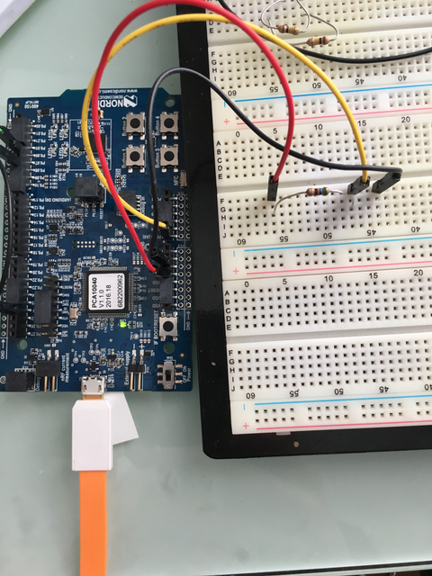
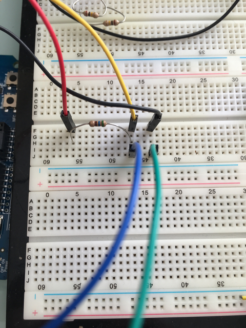
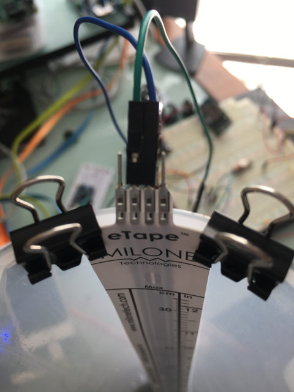
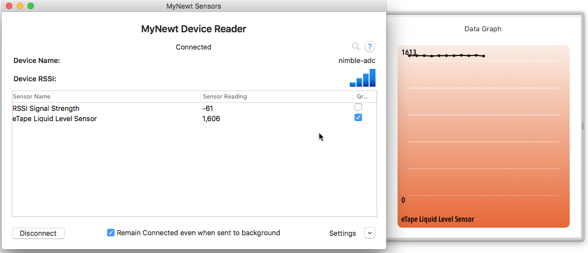

Adding an Analog Sensor on nRF52
--------------------------------

Objective
~~~~~~~~~

We will be adding an analog sensor to the NRF52DK development board and
using the Analog to Digital Converter (ADC) to read the values from the
sensor. It's also using Bluetooth to allow you to connect to the app and
read the value of the sensor. Please see the following section for the
required hardware in order to complete this tutorial.

Hardware needed
~~~~~~~~~~~~~~~

-  nRF52 Development Kit (one of the following)

   -  Dev Kit from Nordic - PCA 10040
   -  Eval Kit from Rigado - BMD-300-EVAL-ES

-  eTape Liquid Sensor -- buy from
   `Adafruit <https://www.adafruit.com/products/1786>`__
-  Laptop running Mac OS
-  It is assumed you have already installed newt tool.
-  It is assumed you already installed native tools as described
   `here <../get_started/native_tools.html>`__

Create a project.
~~~~~~~~~~~~~~~~~

Create a new project to hold your work. For a deeper understanding, you
can read about project creation in `Get Started -- Creating Your First
Project <../get_started/project_create.html>`__ or just follow the
commands below.

::

        $ mkdir ~/dev
        $ cd ~/dev
        $ newt new myadc
        Downloading project skeleton from apache/mynewt-blinky...
        Installing skeleton in myadc...
        Project myadc successfully created.
        $ cd myadc
        

Add Additional Repositories
~~~~~~~~~~~~~~~~~~~~~~~~~~~

The board-specific libraries for the NRF52dk board are in an external
repository at present, so you'll need to include that remote repository
and install it as well. If you're not familiar with using repositories,
see the section on `repositories <repo/add_repos.html>`__ before
continuing. Or just copy and paste the following.

In your ``project.yml`` file, add ``mynewt_nordic`` to the
``project.repositories`` section, and then add the proper repository
definition. When you're done, your ``project.yml`` file should look like
this:

\`\`\`hl\_lines="5 15 16 17 18 19" project.name: "my\_project"

project.repositories: - apache-mynewt-core - mynewt\_nordic

Use github's distribution mechanism for core ASF libraries.
===========================================================

This provides mirroring automatically for us.
=============================================

repository.apache-mynewt-core: type: github vers: 1-latest user: apache
repo: incubator-mynewt-core repository.mynewt\_nordic: type: github
vers: 1-latest user: runtimeco repo: mynewt\_nordic

::

     

    ### Install Everything

    Now that you have defined the needed repositories, it's time to install everything so
    that you can get started.

::

    $ newt install -v 
    apache-mynewt-core
    Downloading repository description for apache-mynewt-core... success!
    ...
    apache-mynewt-core successfully installed version 0.9.0-none
    ...
    mynewt_nordic
    Downloading repository description for mynewt_nordic... success!
    ...
    mynewt_nordic successfully installed version 0.9.9-none

\`\`\`

Create the targets
~~~~~~~~~~~~~~~~~~

Create two targets - one for the bootloader and one for the nrf52 board.

 Note: The correct bsp must be chosen for the board you are using.

-  For the Nordic Dev Kit choose @apache-mynewt-core/hw/bsp/nrf52dk
   instead (in the highlighted lines)
-  For the Rigado Eval Kit choose @apache-mynewt-core/hw/bsp/bmd300eval
   instead (in the highlighted lines)

For the app itself we're going to extend the
`bleprph <belpprph/bleprph-app.html>`__ app so that we get the Bluetooth
communications built in, so the first thing we'll need to do is copy
that app into our own app directory:

.. code-block:: console

    $ mkdir -p apps/nrf52_adc
    $ cp -Rp repos/apache-mynewt-core/apps/bleprph/* apps/nrf52_adc

Next, you'll modify the ``pkg.yml`` file for your app. Note the change
in ``pkg.name`` and ``pkg.description``. Also make sure that you specify
the full path of all the packages with the prefix
``@apache-mynewt-core/`` as shown in the third highlighted line.

\`\`\`hl\_lines="3 5 11" $ cat apps/nrf52\_adc/pkg.yml ... pkg.name:
apps/nrf52\_adc pkg.type: app pkg.description: Simple BLE peripheral
application for ADC Sensors. pkg.author: "Apache Mynewt
dev@mynewt.incubator.apache.org" pkg.homepage:
"http://mynewt.apache.org/" pkg.keywords:

pkg.deps: - "@apache-mynewt-core/boot/split" -
"@apache-mynewt-core/kernel/os" - "@apache-mynewt-core/mgmt/imgmgr" -
"@apache-mynewt-core/mgmt/newtmgr" -
"@apache-mynewt-core/mgmt/newtmgr/transport/ble" -
"@apache-mynewt-core/net/nimble/controller" -
"@apache-mynewt-core/net/nimble/host" -
"@apache-mynewt-core/net/nimble/host/services/ans" -
"@apache-mynewt-core/net/nimble/host/services/gap" -
"@apache-mynewt-core/net/nimble/host/services/gatt" -
"@apache-mynewt-core/net/nimble/host/store/ram" -
"@apache-mynewt-core/net/nimble/transport/ram" -
"@apache-mynewt-core/sys/console/full" -
"@apache-mynewt-core/sys/log/full" -
"@apache-mynewt-core/sys/stats/full" - "@apache-mynewt-core/sys/sysinit"
- "@apache-mynewt-core/sys/id" \`\`\`

Great! We have our very own app so let's make sure we have all of our
targets set correctly:

\`\`\`hl\_lines="3 8" $ newt target create nrf52\_adc $ newt target set
nrf52\_adc app=apps/nrf52\_adc Target targets/nrf52\_adc successfully
set target.app to apps/nrf52\_adc $ newt target set nrf52\_adc
bsp=@apache-mynewt-core/hw/bsp/nrf52dk $ newt target set nrf52\_adc
build\_profile=debug

$ newt target create nrf52\_boot $ newt target set nrf52\_boot
app=@apache-mynewt-core/apps/boot $ newt target set nrf52\_boot
bsp=@apache-mynewt-core/hw/bsp/nrf52dk $ newt target set nrf52\_boot
build\_profile=optimized

$ newt target show targets/nrf52\_adc app=apps/nrf52\_adc
bsp=@apache-mynewt-core/hw/bsp/nrf52dk build\_profile=debug
targets/nrf52\_boot app=@apache-mynewt-core/apps/boot
bsp=@apache-mynewt-core/hw/bsp/nrf52dk build\_profile=optimized

::

    
    Note: If you've already built and installed a bootloader for your NRF52dk then you do
    not need to create a target for it here, or build and load it as below. 
     

    ### Build the target executables 

$ newt build nrf52\_boot ... Compiling boot.c Archiving boot.a Linking
boot.elf App successfully built:
~/dev/myadc/bin/nrf52\_boot/apps/boot/boot.elf

::

$ newt build nrf52\_adc ... Compiling main.c Archiving nrf52\_adc.a
Linking nrf52\_adc.elf App successfully built:
~/dev/myadc/bin/nrf52\_adc/apps/nrf52\_adc/nrf52\_adc.elf

::

     

    ### Sign and create the nrf52_adc application image 

    You must sign and version your application image to download it using newt to the board. 
    Use the newt create-image command to perform this action. You may assign an arbitrary 
    version (e.g. 1.0.0) to the image.

$ newt create-image nrf52\_adc 1.0.0 App image successfully generated:
~/dev/myadc/bin/nrf52\_adc/apps/nrf52\_adc/nrf52\_adc.img Build
manifest: ~/dev/myadc/bin/nrf52\_adc/apps/nrf52\_adc/manifest.json

::

     

    ### Connect the board

    Connect the evaluation board via micro-USB to your PC via USB cable.
            
     

    ### Download to the target

    Download the bootloader first and then the nrf52_adc executable to the target platform. 
    Don't forget to reset the board if you don't see the LED blinking right away!

$ newt load nrf52\_boot $ newt load nrf52\_adc

::

     

    **Note:** If you want to erase the flash and load the image again, you can use JLinkExe to issue an `erase` command.

$ JLinkExe -device nRF52 -speed 4000 -if SWD SEGGER J-Link Commander
V5.12c (Compiled Apr 21 2016 16:05:51) DLL version V5.12c, compiled Apr
21 2016 16:05:45

Connecting to J-Link via USB...O.K. Firmware: J-Link
OB-SAM3U128-V2-NordicSemi compiled Mar 15 2016 18:03:17 Hardware
version: V1.00 S/N: 682863966 VTref = 3.300V

Type "connect" to establish a target connection, '?' for help
J-Link>erase Cortex-M4 identified. Erasing device (0;?i?)... Comparing
flash [100%] Done. Erasing flash [100%] Done. Verifying flash [100%]
Done. J-Link: Flash download: Total time needed: 0.363s (Prepare:
0.093s, Compare: 0.000s, Erase: 0.262s, Program: 0.000s, Verify: 0.000s,
Restore: 0.008s) Erasing done. J-Link>exit $ \`\`\`

So you have a BLE app, but really all you've done is change the name of
the **bleprph** app to **nrf52\_adc** and load that. Not all that
impressive, and it certainly won't read an Analog Sensor right now. So
let's do that next. In order to read an ADC sensor, and since the ADC
package is in an external, licensed, repository, we'll create a driver
for it here in our app that will leverage the existing driver in the
external repository. It adds another layer of indirection, but it will
also give us a look at building our own driver, so we'll do it this way.

Building a Driver
~~~~~~~~~~~~~~~~~

The first thing to do is to create the directory structure for your
driver:

.. code-block:: console

    [user@IsMyLaptop:~/src/air_quality]$ mkdir -p libs/my_drivers/myadc/include/myadc
    [user@IsMyLaptop:~/src/air_quality]$ mkdir -p libs/my_drivers/myadc/src

Now you can add the files you need. You'll need a pkg.yml to describe
the driver, and then header stub followed by source stub.

.. code-block:: console

    [user@IsMyLaptop:~/src/air_quality]$ cat libs/my_drivers/myadc/pkg.yml

.. code:: c

    #
    # Licensed to the Apache Software Foundation (ASF) under one
    # or more contributor license agreements.  See the NOTICE file
    # distributed with this work for additional information
    # regarding copyright ownership.  The ASF licenses this file
    # to you under the Apache License, Version 2.0 (the
    # "License"); you may not use this file except in compliance
    # with the License.  You may obtain a copy of the License at
    # 
    #  http://www.apache.org/licenses/LICENSE-2.0
    #
    # Unless required by applicable law or agreed to in writing,
    # software distributed under the License is distributed on an
    # "AS IS" BASIS, WITHOUT WARRANTIES OR CONDITIONS OF ANY
    # KIND, either express or implied.  See the License for the
    # specific language governing permissions and limitations
    # under the License.
    #
    pkg.name: libs/my_drivers/myadc
    pkg.deps:
        - "@apache-mynewt-core/hw/hal"
        - "@mynewt_nordic/hw/drivers/adc/adc_nrf52"

First, let's create the required header file ``myadc.h`` in the includes
directory i.e. ``libs/my_drivers/myadc/include/myadc/myadc.h``. It's a
pretty straightforward header file, since we only need to do 2 things:

-  Initialize the ADC device
-  Read ADC Values

.. code:: c

    #ifndef _NRF52_ADC_H_
    #define _NRF52_ADC_H_

    void * adc_init(void);
    int adc_read(void *buffer, int buffer_len);

    #endif /* _NRF52_ADC_H_ */

Next we'll need a corresponding source file ``myadc.c`` in the src
directory. This is where we'll implement the specifics of the driver:

.. code:: c

    #include <assert.h>
    #include <os/os.h>
    /* ADC */
    #include "myadc/myadc.h"
    #include "nrf.h"
    #include "app_util_platform.h"
    #include "app_error.h"
    #include <adc/adc.h>
    #include <adc_nrf52/adc_nrf52.h>
    #include "nrf_drv_saadc.h"

    #define ADC_NUMBER_SAMPLES (2)
    #define ADC_NUMBER_CHANNELS (1)

    nrf_drv_saadc_config_t adc_config = NRF_DRV_SAADC_DEFAULT_CONFIG;

    struct adc_dev *adc;
    uint8_t *sample_buffer1;
    uint8_t *sample_buffer2;

    static struct adc_dev os_bsp_adc0;
    static nrf_drv_saadc_config_t os_bsp_adc0_config = {
        .resolution         = MYNEWT_VAL(ADC_0_RESOLUTION),
        .oversample         = MYNEWT_VAL(ADC_0_OVERSAMPLE),
        .interrupt_priority = MYNEWT_VAL(ADC_0_INTERRUPT_PRIORITY),
    };
    void *
    adc_init(void)
    {
        int rc = 0;
        
        rc = os_dev_create((struct os_dev *) &os_bsp_adc0, "adc0",
                OS_DEV_INIT_KERNEL, OS_DEV_INIT_PRIO_DEFAULT,
                nrf52_adc_dev_init, &os_bsp_adc0_config);
        assert(rc == 0);
        nrf_saadc_channel_config_t cc = NRF_DRV_SAADC_DEFAULT_CHANNEL_CONFIG_SE(NRF_SAADC_INPUT_AIN1);
        cc.gain = NRF_SAADC_GAIN1_6;
        cc.reference = NRF_SAADC_REFERENCE_INTERNAL;
        adc = (struct adc_dev *) os_dev_open("adc0", 0, &adc_config);
        assert(adc != NULL);
        adc_chan_config(adc, 0, &cc);
        sample_buffer1 = malloc(adc_buf_size(adc, ADC_NUMBER_CHANNELS, ADC_NUMBER_SAMPLES));
        sample_buffer2 = malloc(adc_buf_size(adc, ADC_NUMBER_CHANNELS, ADC_NUMBER_SAMPLES));
        memset(sample_buffer1, 0, adc_buf_size(adc, ADC_NUMBER_CHANNELS, ADC_NUMBER_SAMPLES));
        memset(sample_buffer2, 0, adc_buf_size(adc, ADC_NUMBER_CHANNELS, ADC_NUMBER_SAMPLES));
        adc_buf_set(adc, sample_buffer1, sample_buffer2,
            adc_buf_size(adc, ADC_NUMBER_CHANNELS, ADC_NUMBER_SAMPLES));
        return adc;
    }

    int
    adc_read(void *buffer, int buffer_len)
    {
        int i;
        int adc_result;
        int my_result_mv = 0;
        int rc;
        for (i = 0; i < ADC_NUMBER_SAMPLES; i++) {
            rc = adc_buf_read(adc, buffer, buffer_len, i, &adc_result);
            if (rc != 0) {
                goto err;
            }
            my_result_mv = adc_result_mv(adc, 0, adc_result);
        }        
        adc_buf_release(adc, buffer, buffer_len);
        return my_result_mv;
    err:
        return (rc);
    }

There's a lot going on in here, so let's walk through it step by step.

First, we define a default configuration, with the resolution,
oversample and interrupt priority. You'll see that these are
``MYNEWT_VAL`` values, which means that we'll define them shortly in a
``syscfg.yml`` file to be passed to the compiler at build time.

.. code:: c

    static struct adc_dev os_bsp_adc0;
    static nrf_drv_saadc_config_t os_bsp_adc0_config = {
        .resolution         = MYNEWT_VAL(ADC_0_RESOLUTION),
        .oversample         = MYNEWT_VAL(ADC_0_OVERSAMPLE),
        .interrupt_priority = MYNEWT_VAL(ADC_0_INTERRUPT_PRIORITY),
    };

Next, in ``adc_init()`` , we need to tell the OS to create the device.

.. code:: c

    void *
    adc_init(void)
    {
        int rc = 0;
        
        rc = os_dev_create((struct os_dev *) &os_bsp_adc0, "adc0",
                OS_DEV_INIT_KERNEL, OS_DEV_INIT_PRIO_DEFAULT,
                nrf52_adc_dev_init, &os_bsp_adc0_config);
        assert(rc == 0);
        nrf_saadc_channel_config_t cc = NRF_DRV_SAADC_DEFAULT_CHANNEL_CONFIG_SE(NRF_SAADC_INPUT_AIN1);
        cc.gain = NRF_SAADC_GAIN1_6;
        cc.reference = NRF_SAADC_REFERENCE_INTERNAL;
        adc = (struct adc_dev *) os_dev_open("adc0", 0, &adc_config);
        assert(adc != NULL);
        adc_chan_config(adc, 0, &cc);
        sample_buffer1 = malloc(adc_buf_size(adc, ADC_NUMBER_CHANNELS, ADC_NUMBER_SAMPLES));
        sample_buffer2 = malloc(adc_buf_size(adc, ADC_NUMBER_CHANNELS, ADC_NUMBER_SAMPLES));
        memset(sample_buffer1, 0, adc_buf_size(adc, ADC_NUMBER_CHANNELS, ADC_NUMBER_SAMPLES));
        memset(sample_buffer2, 0, adc_buf_size(adc, ADC_NUMBER_CHANNELS, ADC_NUMBER_SAMPLES));
        adc_buf_set(adc, sample_buffer1, sample_buffer2,
            adc_buf_size(adc, ADC_NUMBER_CHANNELS, ADC_NUMBER_SAMPLES));
        return adc;
    }

A few things need to be said about this part, as it is the most
confusing. First, we're using a **default** configuration for the ADC
Channel via the ``NRF_DRV_SAADC_DEFAULT_CHANNEL_CONFIG_SE`` macro. The
important part here is that we're actually using ``AIN1``. I know what
you're thinking, "But we want ADC-0!" and that's true. The board is
actually labelled 'A0, A1, A2' etc., and the actual pin numbers are also
listed on the board, which seems handy. At first. But it gets messy very
quickly.

If you try to use AIN0, and then go poke around in the registers while
this is running,

::

    (gdb) p/x {NRF_SAADC_Type}0x40007000
    ...
     CH = {{
          PSELP = 0x1,
          PSELN = 0x0,
          CONFIG = 0x20000,
          LIMIT = 0x7fff8000
        }, 

You'll see that the pin for channel 0 is set to 1, which corresponds to
AIN0, but that's **NOT** the same as A0 -- pin P0.03, the one we're
using. For that, you use AIN1, which would set the pin value to 2.
Messy. Someone, somewhere, thought this made sense.

The only other thing to note here is that we're using the internal
reference voltage, rather than setting our own. There's nothing wrong
with that, but since we are, we'll have to crank up the gain a bit by
using ``NRF_SAADC_GAIN1_6``.

Then, in ``adc_read()`` we will take readings, convert the raw readings
to a millivolt equivalent, and return the result.

.. code:: c

    int
    adc_read(void *buffer, int buffer_len)
    {
        int i;
        int adc_result;
        int my_result_mv = 0;
        int rc;
        for (i = 0; i < ADC_NUMBER_SAMPLES; i++) {
            rc = adc_buf_read(adc, buffer, buffer_len, i, &adc_result);
            if (rc != 0) {
                goto err;
            }
            my_result_mv = adc_result_mv(adc, 0, adc_result);
        }        
        adc_buf_release(adc, buffer, buffer_len);
        return my_result_mv;
    err:
        return (rc);
    }

Finally, we'll need some settings for our driver, as mentioned earlier.
In the ``myadc`` directory you'll need to add a ``syscfg.yml`` file:

.. code-block:: console

    # Package: libs/my_driver/myadc

    syscfg.defs:
        ADC_0:
            description: 'TBD'
            value:  1
        ADC_0_RESOLUTION:
            description: 'TBD'
            value: 'SAADC_CONFIG_RESOLUTION'
        ADC_0_OVERSAMPLE:
            description: 'TBD'
            value: 'SAADC_CONFIG_OVERSAMPLE'
        ADC_0_INTERRUPT_PRIORITY:
            description: 'TBD'
            value: 'SAADC_CONFIG_IRQ_PRIORITY'

Once that's all done, you should have a working ADC Driver for your
NRF52DK board. The last step in getting the driver set up is to include
it in the package dependency defined by ``pkg.deps`` in the ``pkg.yml``
file of your app. Add it in ``apps/nrf52_adc/pkg.yml`` as shown by the
highlighted line below.

.. code:: hl_lines="29"

    # Licensed to the Apache Software Foundation (ASF) under one
    # <snip>

    pkg.name: apps/nrf52_adc
    pkg.type: app
    pkg.description: Simple BLE peripheral application for ADC sensor.
    pkg.author: "Apache Mynewt <dev@mynewt.incubator.apache.org>"
    pkg.homepage: "http://mynewt.apache.org/"
    pkg.keywords:

    pkg.deps: 
        - "@apache-mynewt-core/boot/split"
        - "@apache-mynewt-core/kernel/os"
        - "@apache-mynewt-core/mgmt/imgmgr"
        - "@apache-mynewt-core/mgmt/newtmgr"
        - "@apache-mynewt-core/mgmt/newtmgr/transport/ble"
        - "@apache-mynewt-core/net/nimble/controller"
        - "@apache-mynewt-core/net/nimble/host"
        - "@apache-mynewt-core/net/nimble/host/services/ans"
        - "@apache-mynewt-core/net/nimble/host/services/gap"
        - "@apache-mynewt-core/net/nimble/host/services/gatt"
        - "@apache-mynewt-core/net/nimble/host/store/ram"
        - "@apache-mynewt-core/net/nimble/transport/ram"
        - "@apache-mynewt-core/sys/console/full"
        - "@apache-mynewt-core/sys/log/full"
        - "@apache-mynewt-core/sys/stats/full"
        - "@apache-mynewt-core/sys/sysinit"
        - "@apache-mynewt-core/sys/id"
        - libs/my_drivers/myadc

Creating the ADC Task
~~~~~~~~~~~~~~~~~~~~~

Now that the driver is done, we'll need to add calls to the main app's
``main.c`` file, as well as a few other things. First, we'll need to
update the includes, and add a task for our ADC sampling.

.. code:: c

    #include "myadc/myadc.h"
    ...
    /* ADC Task settings */
    #define ADC_TASK_PRIO           5
    #define ADC_STACK_SIZE          (OS_STACK_ALIGN(336))
    struct os_eventq adc_evq;
    struct os_task adc_task;
    bssnz_t os_stack_t adc_stack[ADC_STACK_SIZE];

Next we'll need o initialize the task ``event_q`` so we'll add the
highlighted code to ``main()`` as shown below:

\`\`\`c hl\_lines="7 8 9 10 11 12 13 14 15" /\* Set the default device
name. \*/ rc = ble\_svc\_gap\_device\_name\_set("nimble-adc"); assert(rc
== 0);

::

    conf_load();

    /* Initialize adc sensor task eventq */
    os_eventq_init(&adc_evq);

    /* Create the ADC reader task.  
     * All sensor operations are performed in this task.
     */
    os_task_init(&adc_task, "sensor", adc_task_handler,
            NULL, ADC_TASK_PRIO, OS_WAIT_FOREVER,
            adc_stack, ADC_STACK_SIZE);

\`\`\ ``We'll need that``\ adc\_task\_handler()\ ``function to exist, and that's where we'll initialize the ADC Device and set the event handler. In the task's while() loop, we'll just make a call to``\ adc\_sample()\`
to cause the ADC driver to sample the adc device.

.. code:: c

    /**
     * Event loop for the sensor task.
     */
    static void
    adc_task_handler(void *unused)
    {
        struct adc_dev *adc;
        int rc;
        /* ADC init */
        adc = adc_init();
        rc = adc_event_handler_set(adc, adc_read_event, (void *) NULL);
        assert(rc == 0);
        
        while (1) {
            adc_sample(adc);
            /* Wait 2 second */
            os_time_delay(OS_TICKS_PER_SEC * 2);
        }
    }

Above the ``adc_task_handler``, add code to handle the
``adc_read_event()`` calls:

.. code:: c

    int
    adc_read_event(struct adc_dev *dev, void *arg, uint8_t etype,
            void *buffer, int buffer_len)
    {
        int value;
        uint16_t chr_val_handle;
        int rc;

        value = adc_read(buffer, buffer_len);
        if (value >= 0) {
            console_printf("Got %d\n", value);
        } else {
            console_printf("Error while reading: %d\n", value);
            goto err;
        }
        gatt_adc_val = value;
        rc = ble_gatts_find_chr(&gatt_svr_svc_adc_uuid.u, BLE_UUID16_DECLARE(ADC_SNS_VAL), NULL, &chr_val_handle);
        assert(rc == 0);
        ble_gatts_chr_updated(chr_val_handle);
        return (0);
    err:
        return (rc);
    } 

This is where we actually read the ADC value and then update the BLE
Characteristic for that value.

But wait, we haven't defined those BLE services and characteristics yet!
Right, so don't try to build and run this app just yet or it will surely
fail. Instead, move on to the next section and get all of those services
defined.

Building the BLE Services
~~~~~~~~~~~~~~~~~~~~~~~~~

If the nrf52\_adc app is going to be a Bluetooth-enabled sensor app that
will allow you to read the value of the eTape Water Level Sensor via
Bluetooth we'll need to actually define those Services and
Characteristics.

As with the `ble peripheral <bleprph/bleprph-app.html>`__ app, we will
advertise a couple of values from our app. The first is not strictly
necessary, but it will help us build an iOS app later. We've defined a
service and the characteristics in that service in ``bleadc.h`` in the
``apps/nrf52_adc/src/`` directory as follows:

.. code:: c

    /* Sensor Data */
    /* e761d2af-1c15-4fa7-af80-b5729002b340 */
    static const ble_uuid128_t gatt_svr_svc_adc_uuid =
            BLE_UUID128_INIT(0x40, 0xb3, 0x20, 0x90, 0x72, 0xb5, 0x80, 0xaf,
                             0xa7, 0x4f, 0x15, 0x1c, 0xaf, 0xd2, 0x61, 0xe7);
    #define ADC_SNS_TYPE          0xDEAD
    #define ADC_SNS_STRING "eTape Liquid Level Sensor"
    #define ADC_SNS_VAL           0xBEAD
    extern uint16_t gatt_adc_val; 

The first is the UUID of the service, followed by the 2 characteristics
we are going to offer. The first characteristic is going to advertise
the *type* of sensor we are advertising, and it will be a read-only
characteristic. The second characteristic will be the sensor value
itself, and we will allow connected devices to 'subscribe' to it in
order to get constantly-updated values.

**Note:** You can choose any valid Characteristic UUIDs to go here.
We're using these values for illustrative purposes only.

The value that we'll be updating is also defined here as
``gatt_adc_val``.

If we then go look at ``gatt_srv.c`` we can see the structure of the
service and characteristic offering that we set up:

\`\`\`c hl\_lines="21 22 23 24 25 26 27 28 29 30 31 32 33 34 35 36 37"
static const struct ble\_gatt\_svc\_def gatt\_svr\_svcs\ ` <#section>`__
= { { /\*\*\* Service: Security test. */ .type =
BLE\_GATT\_SVC\_TYPE\_PRIMARY, .uuid =
&gatt\_svr\_svc\_sec\_test\_uuid.u, .characteristics = (struct
ble\_gatt\_chr\_def\ ` <#section>`__) { { /*\ \*\* Characteristic:
Random number generator. */ .uuid =
&gatt\_svr\_chr\_sec\_test\_rand\_uuid.u, .access\_cb =
gatt\_svr\_chr\_access\_sec\_test, .flags = BLE\_GATT\_CHR\_F\_READ \|
BLE\_GATT\_CHR\_F\_READ\_ENC, }, { /*\ \*\* Characteristic: Static
value. */ .uuid = &gatt\_svr\_chr\_sec\_test\_static\_uuid.u,
.access\_cb = gatt\_svr\_chr\_access\_sec\_test, .flags =
BLE\_GATT\_CHR\_F\_READ \| BLE\_GATT\_CHR\_F\_WRITE \|
BLE\_GATT\_CHR\_F\_WRITE\_ENC, }, { 0, /* No more characteristics in
this service. */ } }, }, { /*\ \*\* ADC Level Notification Service. */
.type = BLE\_GATT\_SVC\_TYPE\_PRIMARY, .uuid =
&gatt\_svr\_svc\_adc\_uuid.u, .characteristics = (struct
ble\_gatt\_chr\_def\ ` <#section>`__) { { .uuid =
BLE\_UUID16\_DECLARE(ADC\_SNS\_TYPE), .access\_cb =
gatt\_svr\_sns\_access, .flags = BLE\_GATT\_CHR\_F\_READ, }, { .uuid =
BLE\_UUID16\_DECLARE(ADC\_SNS\_VAL), .access\_cb =
gatt\_svr\_sns\_access, .flags = BLE\_GATT\_CHR\_F\_NOTIFY, }, { 0, /*
No more characteristics in this service. \*/ } }, },

::

    {
        0, /* No more services. */
    },

}; \`\`\`

You should recognize the first services from the `BLE
Peripheral <bleprph/bleprph-intro.html>`__ tutorial earlier. We're just
adding another Service, with 2 new Characteristics, to that application.

We'll need to fill in the function that will be called for this service,
``gatt_srv_sns_access`` next so that the service knows what to do.

.. code:: c

    static int
    gatt_svr_sns_access(uint16_t conn_handle, uint16_t attr_handle,
                              struct ble_gatt_access_ctxt *ctxt,
                              void *arg)
    {
        uint16_t uuid16;
        int rc;

        uuid16 = ble_uuid_u16(ctxt->chr->uuid);

        switch (uuid16) {
        case ADC_SNS_TYPE:
            assert(ctxt->op == BLE_GATT_ACCESS_OP_READ_CHR);
            rc = os_mbuf_append(ctxt->om, ADC_SNS_STRING, sizeof ADC_SNS_STRING);
            BLEPRPH_LOG(INFO, "ADC SENSOR TYPE READ: %s\n", ADC_SNS_STRING);
            return rc == 0 ? 0 : BLE_ATT_ERR_INSUFFICIENT_RES;

        case ADC_SNS_VAL:
            if (ctxt->op == BLE_GATT_ACCESS_OP_WRITE_CHR) {
                rc = gatt_svr_chr_write(ctxt->om, 0,
                                        sizeof gatt_adc_val,
                                        &gatt_adc_val,
                                        NULL);
                return rc;
            } else if (ctxt->op == BLE_GATT_ACCESS_OP_READ_CHR) {
                rc = os_mbuf_append(ctxt->om, &gatt_adc_val,
                                    sizeof gatt_adc_val);
                return rc == 0 ? 0 : BLE_ATT_ERR_INSUFFICIENT_RES;
            }

        default:
            assert(0);
            return BLE_ATT_ERR_UNLIKELY;
        }
    }

You can see that when request is for the ``ADC_SNS_TYPE``, we return the
Sensor Type we defined earlier. If the request if for ``ADC_SNS_VAL``
we'll return the ``gatt_adc_val`` value.

Don't forget to include the ``bleadc.h`` include file at the top of the
``gatt_svr.c`` file!

.. code:: hl_lines="8"

    #include <assert.h>
    #include <stdio.h>
    #include <string.h>
    #include "bsp/bsp.h"
    #include "host/ble_hs.h"
    #include "host/ble_uuid.h"
    #include "bleprph.h"
    #include "bleadc.h"

If you build, load and run this application now, you will see all those
Services and Characteristics advertised, and you will even be able to
read the "Sensor Type" String via the ADC\_SNS\_TYPE Characteristic.

Adding the eTape Water Sensor
~~~~~~~~~~~~~~~~~~~~~~~~~~~~~

Now that we have a fully functioning BLE App that we can subscribe to
sensor values from, it's time to actually wire up the sensor!

As previously mentioned, we're going to be using an eTape Water Level
Sensor. You can get one from
`Adafruit <https://www.adafruit.com/products/1786>`__.

We're going to use the sensor as a resistive sensor, and the setup is
very simple. I'll be using a 'breadboard\` to put this all together for
illustrative purposes. First, attach a jumper-wire from Vdd on the board
to the breadboard. Next, attach a jumper wire from pin P0.03 on the
board to the breadboard. This will be our ADC-in. The sensor should have
come with a 560 ohm resistor, so plug that into the board between Vdd
and ADC-in holes. Finally, attach a jumper from GND on the board to your
breadboard. At this point, your breadboard should look like this:

   Bread Board Setup

Now attach one of the middle 2 leads from the sensor to ground on the
breadboard and the other middle lead to the ADC-in on the breadboard.
Your breadboard should now look like this:

   Bread Board Final

And your eTape Sensor should look like this (at least if you have it
mounted in a graduated cylinder as I do).

   eTape Sensor Setup

That concludes the hardware portion. Easy!

At this point you should be able to build, create-image and load your
application and see it properly sending readings.

Conclusion
~~~~~~~~~~

Congratulations, you've now completed both a hardware project and a
software project by connecting a sensor to your device and using Mynewt
to read data from that sensor and send it via Bluetooth to a connected
device. That's no small feat!

If you see anything missing or want to send us feedback, please do so by
signing up for appropriate mailing lists on our `Community
Page <../../community.html>`__.

Keep on hacking and sensing!

Note
~~~~

If you're wondering how to actually view these sensor readings via
Bluetooth, you have a couple of options. On Mac OS or iOS you can
download the `LightBlue
app <https://itunes.apple.com/us/app/lightblue-explorer-bluetooth/id557428110?mt=8>`__.
This app lets you connect to, and interrogate, BLE devices like the one
you just built.

If you used the BLE Service and Characteristic UUIDs used in this
tutorial, you can also download and use a Mac OS `MyNewt Sensor Reader
App <https://dragonflyiot.com/MyNewtSensorReader.zip>`__ (Zip Archive)
that allows you to graph your data, etc. An iOS version is in Beta
testing and should be available soon.

   My Newt Sensor Reader

Enjoy!
