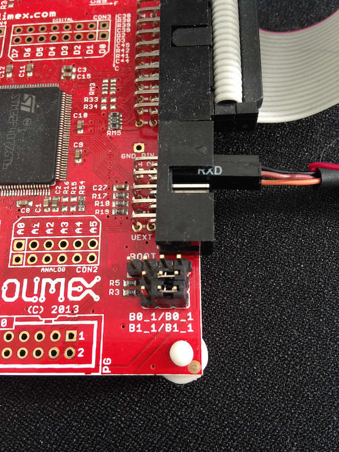

Project Slinky Using Olimex Board
---------------------------------

This tutorial shows you how to create, build and run the Slinky
application and communicate with newtmgr for an Olimex STM-E407 board.
###Prerequisites \* Meet the prerequisites listed in `Project
Slinky </os/tutorials/project-slinky.html>`__. \* Have a STM32-E407
development board from Olimex. \* Have a ARM-USB-TINY-H connector with
JTAG interface for debugging ARM microcontrollers (comes with the ribbon
cable to hook up to the board) \* Have a USB A-B type cable to connect
the debugger to your computer. \* Have a USB to TTL Serial Cable with
female wiring harness. \* Install the `OpenOCD
debugger </os/get_started/cross_tools/>`__.

Create a New Project
~~~~~~~~~~~~~~~~~~~~

Create a new project if you do not have an existing one. You can skip
this step and proceed to `create the targets <#create_targets>`__ if you
already have a project created or completed the `Sim
Slinky <project-slinky.html>`__ tutorial.

.. code-block:: console

    $ newt new slinky
    Downloading project skeleton from apache/mynewt-blinky...
    ...
    Installing skeleton in slink...
    Project slink successfully created
    $ cd slinky
    $newt install
    apache-mynewt-core

 Create the Targets
~~~~~~~~~~~~~~~~~~~

Create two targets for the STM32-E407 board - one for the bootloader and
one for the Slinky application.

Run the following ``newt target`` commands, from your project directory,
to create a bootloader target. We name the target ``stm32_boot``.

.. code-block:: console

    $ newt target create stm32_boot
    $ newt target set stm32_boot bsp=@apache-mynewt-core/hw/bsp/olimex_stm32-e407_devboard
    $ newt target set stm32_boot build_profile=optimized
    $ newt target set stm32_boot target.app=@apache-mynewt-core/apps/boot

 Run the following ``newt target`` commands to create a target for the
Slinky application. We name the target ``stm32_slinky``.

.. code-block:: console

    $ newt target create stm32_slinky
    $ newt target set stm32_slinky bsp=@apache-mynewt-core/hw/bsp/olimex_stm32-e407_devboard
    $ newt target set stm32_slinky build_profile=debug
    $ newt target set stm32_slinky app=@apache-mynewt-core/apps/slinky

Build the Targets
~~~~~~~~~~~~~~~~~

Run the ``newt build stm32_boot`` command to build the bootloader:

.. code-block:: console

    $ newt build stm32_boot
    Building target targets/stm32_boot
    Compiling repos/apache-mynewt-core/boot/bootutil/src/image_ec256.c
    Compiling repos/apache-mynewt-core/boot/bootutil/src/image_rsa.c
    Compiling repos/apache-mynewt-core/boot/bootutil/src/loader.c
    Compiling repos/apache-mynewt-core/boot/bootutil/src/image_ec.c
    Compiling repos/apache-mynewt-core/boot/bootutil/src/image_validate.c
    Compiling repos/apache-mynewt-core/crypto/mbedtls/src/aes.c
    Compiling repos/apache-mynewt-core/boot/bootutil/src/bootutil_misc.c
    Compiling repos/apache-mynewt-core/apps/boot/src/boot.c

          ...

    Archiving sys_mfg.a
    Archiving sys_sysinit.a
    Archiving util_mem.a
    Linking ~/dev/slinky/bin/targets/stm32_boot/app/apps/boot/boot.elf
    Target successfully built: targets/stm32_boot
    $

 Run the ``newt build stm32_slinky`` command to build the Slinky
application:

.. code-block:: console

    $newt build stm32_slinky
    Building target targets/stm32_slinky
    Compiling repos/apache-mynewt-core/boot/bootutil/src/image_ec.c
    Compiling repos/apache-mynewt-core/boot/bootutil/src/image_rsa.c
    Compiling repos/apache-mynewt-core/boot/bootutil/src/image_ec256.c
    Compiling repos/apache-mynewt-core/boot/bootutil/src/loader.c
    Compiling repos/apache-mynewt-core/boot/bootutil/src/image_validate.c
    Compiling repos/apache-mynewt-core/boot/split/src/split.c
    Compiling repos/apache-mynewt-core/boot/bootutil/src/bootutil_misc.c
    Compiling repos/apache-mynewt-core/apps/slinky/src/main.c

           ...

    Archiving util_crc.a
    Archiving util_mem.a
    Linking ~/dev/slinky/bin/targets/stm32_slinky/app/apps/slinky/slinky.elf
    Target successfully built: targets/stm32_slinky
    $

 ### Sign and Create the Slinky Application Image

Run the ``newt create-image stm32_slinky 1.0.0`` command to create and
sign the application image. You may assign an arbitrary version (e.g.
1.0.0) to the image.

.. code-block:: console

    newt create-image stm32_slinky 1.0.0
    App image succesfully generated: ~/dev/slinky/bin/targets/stm32_slinky/app/apps/slinky/slinky.img
    $

Connect to the Board
~~~~~~~~~~~~~~~~~~~~

-  Connect the USB A-B type cable to the ARM-USB-TINY-H debugger
   connector.
-  Connect the ARM-USB-Tiny-H debugger connector to your computer and
   the board.
-  Connect the USB Micro-A cable to the USB-OTG2 port on the board.
-  Set the Power Sel jumper on the board to pins 5 and 6 to select
   USB-OTG2 as the power source. If you would like to use a different
   power source, refer to the `OLIMEX STM32-E407 user
   manual <https://www.olimex.com/Products/ARM/ST/STM32-E407/resources/STM32-E407.pdf>`__
   for pin specifications.

You should see a red LED light up on the board.

 ### Load the Bootloader and the Slinky Application Image

Run the ``newt load stm32_boot`` command to load the bootloader onto the
board:

.. code-block:: console

    $ newt load stm32_boot
    Loading bootloader
    $

 Note: If you are using Windows and get a ``no device found`` error, you
will need to install the usb driver. Download
`Zadig <http://zadig.akeo.ie>`__ and run it:

-  Select Options > List All Devices.
-  Select ``Olimex OpenOCD JTAG ARM-USB-TINY-H`` from the drop down
   menu.
-  Select the ``WinUSB`` driver.
-  Click Install Driver.
-  Run the ``newt load stm32_boot`` command again.

 Run the ``newt load stm32_slinky`` command to load the Slinky
application image onto the board:

.. code-block:: console

    $ newt load stm32_slinky
    Loading app image into slot 1
    $

Connect Newtmgr with the Board using a Serial Connection
~~~~~~~~~~~~~~~~~~~~~~~~~~~~~~~~~~~~~~~~~~~~~~~~~~~~~~~~

Locate the PC6/USART6\_TX (pin 3), PC7/USART6\_RX (pin 4), and GND (pin
2) of the UEXT connector on the Olimex board. More information on the
UEXT connector can be found at
https://www.olimex.com/Products/Modules/UEXT/. The schematic of the
board can be found at
https://www.olimex.com/Products/ARM/ST/STM32-E407/resources/STM32-E407_sch.pdf
for reference.

   Alt Layout - Serial Connection

-  Connect the female RX pin of the USB-TTL serial cable to the TX (Pin
   3) of the UEXT connector on the board.
-  Connect the female TX pin of the USB-TTL serial cable to the RX (Pin
   4) of the UEXT connector on the board.
-  Connect the GND pin of the USB-TTL serial cable to the GND (Pin 2) of
   the UEXT connector on the board.

 Locate the port, in the /dev directory on your computer, that the
serial connection uses. The format of the port name is platform
dependent:

-  Mac OS uses the format ``tty.usbserial-<some identifier>``.
-  Linux uses the format ``TTYUSB<N>``, where ``N`` is a number. For
   example, TTYUSB2.
-  MinGW on Windows uses the format ``ttyS<N>``, where ``N`` is a
   number. You must map the port name to a Windows COM port:
   ``/dev/ttyS<N>`` maps to ``COM<N+1>``. For example, ``/dev/ttyS2``
   maps to ``COM3``.

   You can also use the Windows Device Manager to find the COM port
   number.

.. code-block:: console

    $ ls /dev/tty*usbserial*
    /dev/tty.usbserial-1d13
    $

 Setup a newtmgr connection profile for the serial port. For our
example, the port is ``/dev/tty.usbserial-1d13``.

Run the ``newtmgr conn add`` command to define a newtmgr connection
profile for the serial port. We name the connection profile
``stm32serial``.

**Note**:

-  You will need to replace the ``connstring`` with the specific port
   for your serial connection.
-  On Windows, you must specify ``COM<N+1>`` for the connstring if
   ``/dev/ttyS<N>`` is the serial port.

.. code-block:: console

    $ newtmgr conn add stm32serial type=serial connstring=/dev/tty.usbserial-1d13
    Connection profile stm32serial successfully added
    $

 You can run the ``newt conn show`` command to see all the newtmgr
connection profiles:

.. code-block:: console

    $ newtmgr conn show
    Connection profiles:
      stm32serial: type=serial, connstring='/dev/tty.usbserial-1d13'
      sim1: type=serial, connstring='/dev/ttys012'
    $

 ### Use Newtmgr to Query the Board Run some newtmgr commands to query
and receive responses back from the board (See the `Newt Manager
Guide <newtmgr/overview>`__ for more information on the newtmgr
commands).

Run the ``newtmgr echo hello -c stm32serial`` command. This is the
simplest command that requests the board to echo back the text.

.. code-block:: console

    $ newtmgr echo hello -c stm32serial
    hello
    $

 Run the ``newtmgr image list -c stm32serial`` command to list the
images on the board:

.. code-block:: console

    $ newtmgr image list -c stm32serial
    Images:
     slot=0
        version: 1.0.0
        bootable: true
        flags: active confirmed
        hash: 9cf8af22b1b573909a8290a90c066d4e190407e97680b7a32243960ec2bf3a7f
    Split status: N/A
    $

 Run the ``newtmgr taskstat -c stm32serial`` command to display the task
statistics on the board:

.. code-block:: console

    $ newtmgr taskstat -c stm32serial
          task pri tid  runtime      csw    stksz   stkuse last_checkin next_checkin
          idle 255   0   157179   157183       64       25        0        0
          main 127   1        4       72     1024      356        0        0
         task1   8   2        0      158      192      114        0        0
         task2   9   3        0      158       64       30        0        0
    $
