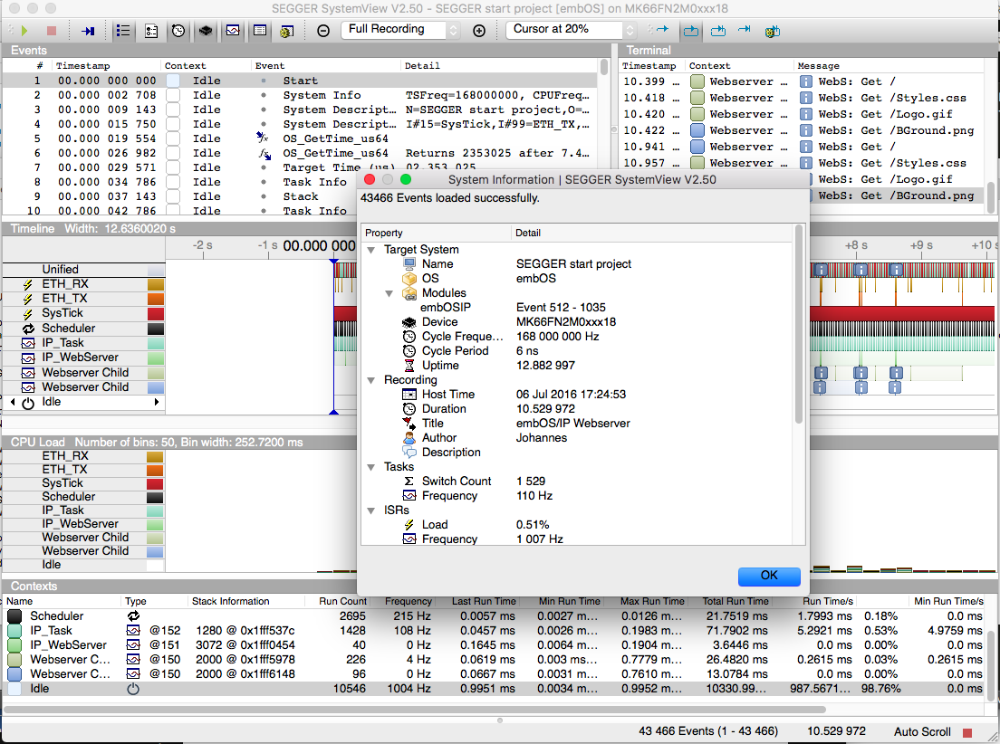
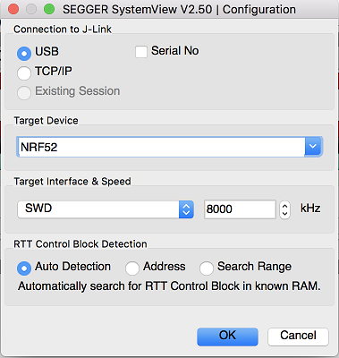
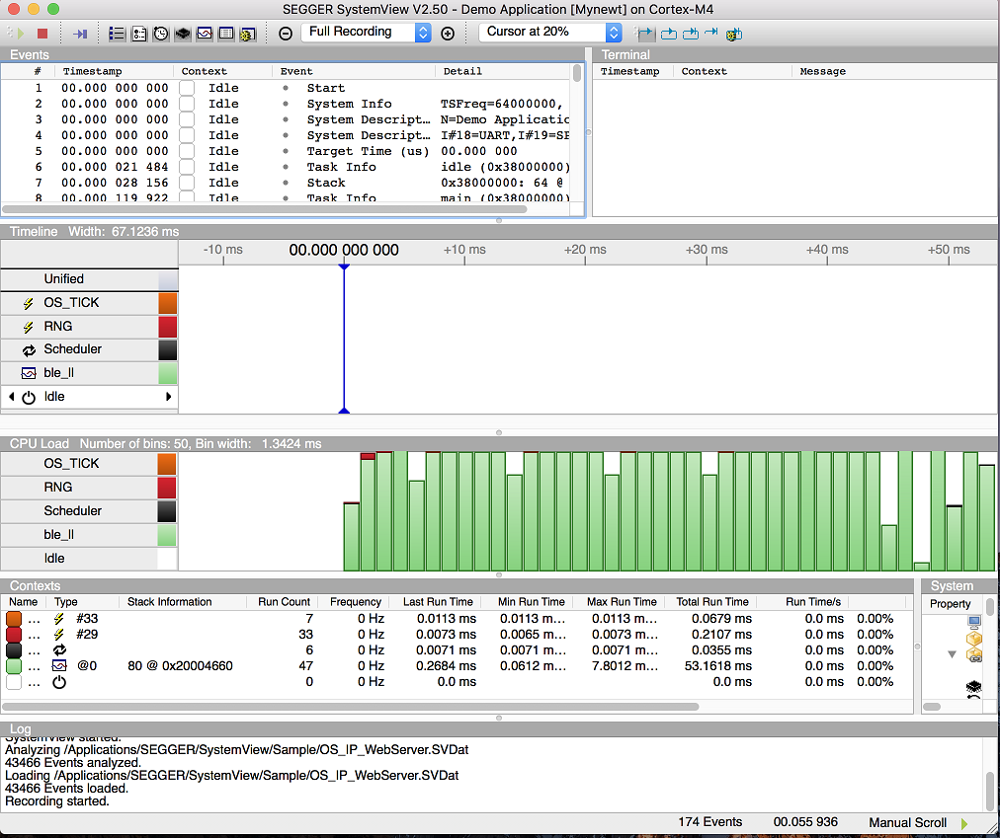

SEGGER SystemView
-----------------

 ### Objective

With `SEGGER's SystemView <https://www.segger.com/systemview.html>`__
you can "record data from the target system while it is running. The
recorded data is analyzed and the system behavior is visualized in
different views."

Hardware needed
~~~~~~~~~~~~~~~

You'll need a SEGGER J-Link programmer in order to use this advanced
functionality. You might have an external J-Link programmer you're
already using, or maybe your board has a dedicated J-Link onboard as
some development kits do. Another possibilty is J-Link OB firmware
available for some devices like the micro:bit.

Software needed
~~~~~~~~~~~~~~~

-  Download `SEGGER's SystemView
   app <https://www.segger.com/downloads/free-utilities/>`__.
-  Copy the description file from sys/sysview/SYSVIEW\_Mynewt.txt to the
   /Description/ directory of SystemView

Setup the target
~~~~~~~~~~~~~~~~

We'll assume you have an existing example we're enabling SystemView on,
in this case `blinky on nrf52 <nRF52.html>`__. We can do so with the newt
target amend command:

::

    newt target amend blink_nordic syscfg=OS_SYSVIEW=1

Run the target executables
~~~~~~~~~~~~~~~~~~~~~~~~~~

Now 'run' the newt target as you'll need an active debugger process to
attach to:

::

    $ newt run blink_nordic 0
    App image succesfully generated: ~/Downloads/myproj/bin/targets/blink_nordic/app/apps/bleprph/bleprph.img
    Loading app image into slot 1
    [~/Downloads/myproj/repos/apache-mynewt-core/hw/bsp/nrf52-thingy/nrf52-thingy_debug.sh ~/Downloads/myproj/repos/apache-mynewt-core/hw/bsp/nrf52-thingy ~/Downloads/myproj/bin/targets/blink_nordic/app/apps/bleprph/bleprph]
    Debugging ~/Downloads/myproj/bin/targets/blink_nordic/app/apps/bleprph/bleprph.elf
    GNU gdb (GNU Tools for ARM Embedded Processors) 7.8.0.20150604-cvs
    Copyright (C) 2014 Free Software Foundation, Inc.
    License GPLv3+: GNU GPL version 3 or later <http://gnu.org/licenses/gpl.html>
    This is free software: you are free to change and redistribute it.
    There is NO WARRANTY, to the extent permitted by law.  Type "show copying"
    and "show warranty" for details.
    This GDB was configured as "--host=x86_64-apple-darwin10 --target=arm-none-eabi".
    Type "show configuration" for configuration details.
    For bug reporting instructions, please see:
    <http://www.gnu.org/software/gdb/bugs/>.
    Find the GDB manual and other documentation resources online at:
    <http://www.gnu.org/software/gdb/documentation/>.
    For help, type "help".
    Type "apropos word" to search for commands related to "word"...
    Reading symbols from ~/Downloads/myproj/bin/targets/blink_nordic/app/apps/bleprph/bleprph.elf...done.
    0x000000d8 in ?? ()
    Resetting target
    0x000000dc in ?? ()

Launch the app
~~~~~~~~~~~~~~

 Launch the app and press **OK** in the System Information dialog box.

   SEGGER SystemView

Select \*\* Target > Start Recording \*\* and press **OK** in the
Configuration dialog box.

   SEGGER SystemView Start Recording

You should see the recording for your Mynewt application.

   SEGGER SystemView Recording
