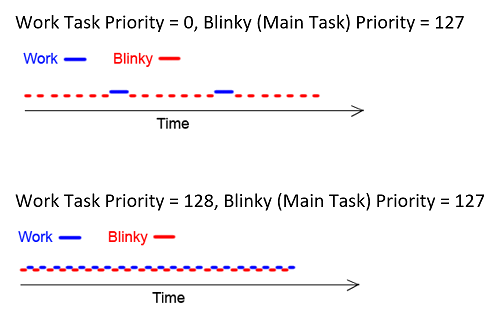

Tasks and Priority Management
=============================

**Target Platform: Arduino M0 Pro** (or legacy Arduino Zero or Zero Pro,
but not Arduino M0)

This lesson is designed to teach core OS concepts and strategies
encountered when building applications using Mynewt. Specifically, this
lesson will cover tasks, simple multitasking, and priority management
running on an Arduino M0 Pro.

Prerequisites
-------------

Before starting, you should read about Mynewt in the
`*Introduction* <http://mynewt.apache.org/os/introduction/>`__ section
and complete the
`*QuickStart* <http://mynewt.apache.org/os/get_started/get_started/>`__
guide and the
`*Blinky* <http://mynewt.apache.org/os/tutorials/arduino_zero/>`__
tutorial. Furthermore, it may be helpful to take a peek at the `*task
documentation* <http://mynewt.apache.org/os/core_os/task/task/>`__ for
additional insights.

Equipment
---------

You will need the following equipment:

-  Arduino M0 Pro (or legacy Arduino Zero or Zero Pro, but not Arduino
   M0)
-  Computer with Mynewt installed
-  USB to Micro USB Cable

Build Your Application
----------------------

To save time, we will simply modify the Blinky application. We'll add
the Task Management code to the Blinky application. Follow the `*Arduino
Zero Blinky
tutorial* <http://mynewt.apache.org/os/tutorials/arduino_zero/>`__ to
create a new project and build your bootloader and application. Finally,
build and load the application to your Arduino to verify that everything
is in order. Now let’s get started!

Default Main Task
-----------------

During Mynewt system startup, Mynewt creates a default main task and
executes the application ``main()`` function in the context of this
task. The main task priority defaults to 127 and can be configured with
the ``OS_MAIN_TASK_PRIO`` system configuration setting.

The blinky application only has the ``main`` task. The ``main()``
function executes an infinite loop that toggles the led and sleeps for
one second. ##Create a New Task

The purpose of this section is to give an introduction to the important
aspects of tasks and how to properly initialize them. First, let’s
define a second task called ``work_task`` in main.c (located in
apps/blinky/src):

.. code:: c

    struct os_task work_task;

A task is represented by the
`*os\_task* <http://mynewt.apache.org/os/core_os/task/task/#data-structures>`__
struct which will hold the task’s information (name, state, priority,
etc.). A task is made up of two main elements, a task function (also
known as a task handler) and a task stack.

Next, let’s take a look at what is required to initialize our new task.

Task Stack
~~~~~~~~~~

The task stack is an array of type ``os_stack_t`` which holds the
program stack frames. Mynewt gives us the ability to set the stack size
for a task giving the application developer room to optimize memory
usage. Since we’re not short on memory, our ``work_stack`` is plenty
large for the purpose of this lesson. Notice that the elements in our
task stack are of type ``os_stack_t`` which are generally 32 bits,
making our entire stack 1024 Bytes.

.. code:: c

      #define WORK_STACK_SIZE OS_STACK_ALIGN(256)

Note: The ``OS_STACK_ALIGN`` macro is used to align the stack based on
the hardware architecture.

Task Function
~~~~~~~~~~~~~

A task function is essentially an infinite loop that waits for some
“event” to wake it up. In general, the task function is where the
majority of work is done by a task. Let’s write a task function for
``work_task`` called ``work_task_handler()``:

.. code:: c

    void
    work_task_handler(void *arg)
    {
        struct os_task *t;

        g_led_pin = LED_BLINK_PIN;
        hal_gpio_init_out(g_led_pin, 1);
        
        while (1) {
            t = os_sched_get_current_task();
            assert(t->t_func == work_task_handler);
            /* Do work... */
        }
    }

The task function is called when the task is initially put into the
*running* state by the scheduler. We use an infinite loop to ensure that
the task function never returns. Our assertion that the current task's
handler is the same as our task handler is for illustration purposes
only and does not need to be in most task functions.

Task Priority
~~~~~~~~~~~~~

As a preemptive, multitasking RTOS, Mynewt decides which tasks to run
based on which has a higher priority; the highest priority being 0 and
the lowest 255. Thus, before initializing our task, we must choose a
priority defined as a macro variable.

Let’s set the priority of ``work_task`` to 0, because everyone knows
that work is more important than blinking.

.. code:: c

      #define WORK_TASK_PRIO (0)

Initialization
~~~~~~~~~~~~~~

To initialize a new task we use
`*os\_task\_init()* <http://mynewt.apache.org/os/core_os/task/os_task_init/>`__
which takes a number of arguments including our new task function,
stack, and priority.

Add the ``init_tasks()`` function to initialize ``work_task`` to keep
our main function clean.

.. code:: c

    int
    init_tasks(void)
    {
        /* … */
        os_stack_t *work_stack;
        work_stack = malloc(sizeof(os_stack_t)*WORK_STACK_SIZE);
        
        assert(work_stack);
        os_task_init(&work_task, "work", work_task_handler, NULL,
                WORK_TASK_PRIO, OS_WAIT_FOREVER, work_stack,
                WORK_STACK_SIZE);

        return 0;
    }

Add the call to ``init_tasks()`` in ``main()`` before the ``while``
loop:

.. code:: c

    int
    main(int argc, char **argv)
    {

            ...

        /* Initialize the work task */
        init_tasks();

        while (1) {
             ...
        }
    }

 And that’s it! Now run your application using the newt run command.

::

    $ newt run arduino_blinky 0.0.0

 When GDB appears press C then Enter to continue and … *wait, why
doesn't our LED blink anymore?*

 #### Review Before we run our new app, let’s review what we need in
order to create a task. This is a general case for a new task called
mytask:

**1)** Define a new task, task stack, and priority:

.. code:: c

    /* My Task */
    struct os_task mytask
    /* My Task Stack */
    #define MYTASK_STACK_SIZE OS_STACK_ALIGN(256)
    os_stack_t mytask_stack[MYTASK_STACK_SIZE];
    /* My Task Priority */
    #define MYTASK_PRIO (0)

**2)** Define task function:

.. code:: c

    void 
    mytask_handler(void *arg)
    {
      while (1) {
          /* ... */
      }
    }

**3)** Initialize the task:

.. code:: c

    os_task_init(&mytask, "mytask", mytask_handler, NULL, 
                MYTASK_PRIO, OS_WAIT_FOREVER, mytask_stack,
                MYTASK_STACK_SIZE);

Task Priority, Preempting, and Context Switching
------------------------------------------------

A preemptive RTOS is one in which a higher priority task that is *ready
to run* will preempt (i.e. take the place of) the lower priority task
which is *running*. When a lower priority task is preempted by a higher
priority task, the lower priority task’s context data (stack pointer,
registers, etc.) is saved and the new task is switched in.

In our example, ``work_task`` (priority 0) has a higher priority than
the ``main`` task (priority 127). Since ``work_task`` is never put into
a *sleep* state, it holds the processor focus on its context.

Let’s give ``work_task`` a delay and some simulated work to keep it
busy. The delay is measured in os ticks and the actual number of ticks
per second is dependent on the board. We multiply ``OS_TICKS_PER_SEC``,
which is defined in the MCU, by the number of seconds we wish to delay.

.. code:: c

    void
    work_task_handler(void *arg)
    {
        struct os_task *t;

        g_led_pin = LED_BLINK_PIN;
        hal_gpio_init_out(g_led_pin, 1);

        while (1) {
            t = os_sched_get_current_t:ask();
            assert(t->t_func == work_task_handler);
            /* Do work... */
            int i;
            for(i = 0; i < 1000000; ++i) {
                /* Simulate doing a noticeable amount of work */
                hal_gpio_write(g_led_pin, 1);
            }
            os_time_delay(3 * OS_TICKS_PER_SEC);
        }
    }

 In order to notice the LED changing, modify the time delay in
``main()`` to blink at a higher frequency.

.. code:: c

    os_time_delay(OS_TICKS_PER_SEC/10);

 Before we run the app, let’s predict the behavior. With the newest
additions to ``work_task_handler()``, our first action will be to sleep
for three seconds. This allows the ``main`` task, running ``main()``, to
take over the CPU and blink to its heart’s content. After three seconds,
``work_task`` will wake up and be made *ready to run*. This causes it to
preempt the ``main`` task. The LED will then remain lit for a short
period while ``work_task`` loops, then blink again for another three
seconds while ``work_task`` sleeps.

You should see that our prediction was correct!

Priority Management Considerations
~~~~~~~~~~~~~~~~~~~~~~~~~~~~~~~~~~

When projects grow in scope, from blinking LEDs into more sophisticated
applications, the number of tasks needed increases alongside complexity.
It remains important, then, that each of our tasks is capable of doing
its work within a reasonable amount of time.

Some tasks, such as the Shell task, execute quickly and require almost
instantaneous response. Therefore, the Shell task should be given a high
priority. On the other hand, tasks which may be communicating over a
network, or processing data, should be given a low priority in order to
not hog the CPU.

The diagram below shows the different scheduling patterns we would
expect when we set the ``work_task`` priority higher and lower than the
``main`` task priority.

   Task Scheduling

In the second case where the ``main`` task has a higher priority,
``work_task`` runs and executes “work” when the ``main`` task sleeps,
saving us idle time compared to the first case.

**Note:** Defining the same priority for two tasks fires an assert in
os\_task\_init() and must be avoided. Priority 127 is reserved for main
task, 255 for idle task.
