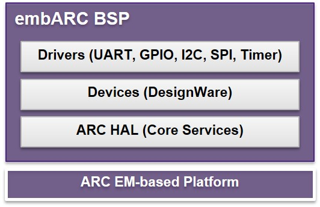

# embARC BSP for EMSK
## Introduction
The embARC Board support Package (BSP) for DesignWare® ARC® EM Starter Kit (EMSK) is a software distribution aimed at facilitating the development and evaluation of embedded systems based on ARCv2 processors.

It is designed to provide a board support package for ARC EMSK users by defining consistent and simple software interfaces to the processors and onboard devices.

## embARC BSP Features
embARC BSP architecture is shown in the block diagram below.

embARC BSP provides ARC Hardware Abstraction Layer (HAL), device HAL and driver implementation for UART, I2C, GPIO and SPI. A group of driver implementations for DesignWare IP peripherals are provided in embARC BSP for EMSK.

[ARC Development Tools](https://www.synopsys.com/designware-ip/processor-solutions/arc-processors/arc-development-tools.html) are supported in embARC BSP, [Premium MetaWare Development Toolkit (>=2016.12)](http://www.synopsys.com/dw/ipdir.php?ds=sw_metaware) and [Opensource ARC GNU IDE(>=2016.09)](https://github.com/foss-for-synopsys-dwc-arc-processors/toolchain/releases).

### embARC BSP & embARC OSP

embARC BSP code is originated from [embARC OSP](https://github.com/foss-for-synopsys-dwc-arc-processors/embarc_osp). The code are reorganized with the same ARC HAL, device HAL and driver implementations for DesignWare IP peripherals. The operating system layer, common library layer, middleware layer and applications are not included in embARC BSP. The code in embARC BSP is independent with build system. It can be ported to various build system easily. The lightweight makefile and Eclipse IDE are both supported in embARC BSP as reference.

## Get Started with embARC BSP
* Use [Premium MetaWare Development Toolkit (>=2016.12)](http://www.synopsys.com/dw/ipdir.php?ds=sw_metaware) in embARC BSP
* Use [Opensource ARC GNU IDE(>=2016.09)](https://github.com/foss-for-synopsys-dwc-arc-processors/toolchain/releases) in embARC BSP
